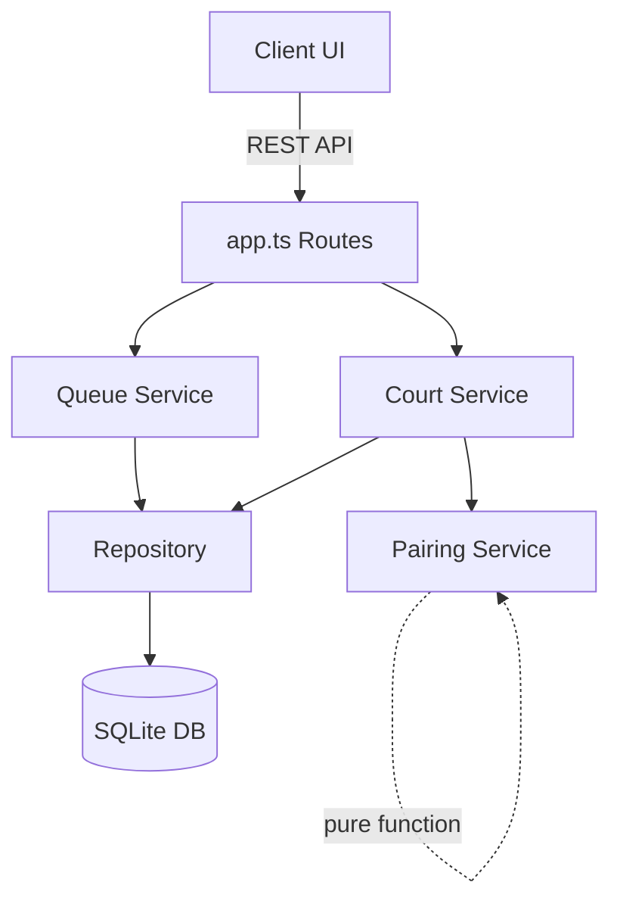

# Design Document: Fixed Team Pairing

## Overview

This feature introduces the concept of "Fixed Pairs" — two players locked together as permanent teammates for the duration of a session. A Fixed Pair occupies a single slot in the queue, moves as one unit, and is treated as indivisible by the pairing algorithm. The pair's effective rating for matchmaking is the average of both players' individual ratings.

The design extends three core layers of the existing architecture:
1. **Data layer** — A new `fixed_pairs` table and a `pair_id` column on `queue_entries`
2. **Queue service** — Create/dissolve pair operations, pair-aware queue management
3. **Pairing service** — Treat pairs as single candidates in both smart and FIFO modes
4. **Client** — Visual indicators for pairs in queue and on courts, organizer controls

## Architecture

The feature integrates into the existing layered architecture:



**Key architectural decisions:**

1. **Pair as a first-class entity**: A `fixed_pairs` table stores the pair relationship. Queue entries reference the pair via a nullable `pair_id` foreign key. This keeps the existing `queue_entries` table structure intact while adding pair awareness.

2. **Single queue slot for pairs**: When a pair is created, both individual queue entries are removed and a single "pair slot" entry is inserted. The pair slot uses one of the two player IDs as the `player_id` (the one with the earlier original position) and carries the `pair_id` to indicate it represents both players.

3. **Pure pairing function unchanged in signature**: The `selectPairing` and `selectFifoPairing` functions remain pure. The court service builds the candidate pool with pair-aware logic, representing each pair as a single candidate with a combined rating. The pairing result maps pair candidates back to their constituent players.

4. **Pair lifecycle tied to session**: Pairs are automatically dissolved when a session ends. No pair data persists beyond the session.

## Components and Interfaces

### New: Fixed Pair Service (`fixedPairService.ts`)

Responsible for creating and dissolving fixed pairs with validation.

```typescript
export interface FixedPair {
  id: string;           // UUID
  sessionId: string;    // FK to sessions
  player1Id: string;    // FK to players
  player2Id: string;    // FK to players
  createdAt: string;    // ISO timestamp
}

/**
 * Creates a fixed pair from two queued players.
 * Validates: both in queue, neither already paired, neither in active match, session active.
 * Removes both individual queue entries, inserts single pair slot at earlier position.
 */
export function createFixedPair(sessionId: string, player1Id: string, player2Id: string): FixedPair;

/**
 * Dissolves a fixed pair, returning both players as individual queue entries.
 * Validates: pair exists, neither player in active match.
 * Removes pair slot, inserts two individual entries at consecutive positions.
 */
export function dissolveFixedPair(sessionId: string, pairId: string): void;

/**
 * Dissolves all fixed pairs in a session (called on session end).
 */
export function dissolveAllPairs(sessionId: string): void;

/**
 * Gets all fixed pairs for a session.
 */
export function getFixedPairsBySession(sessionId: string): FixedPair[];

/**
 * Gets the fixed pair a player belongs to, if any.
 */
export function getFixedPairByPlayerId(sessionId: string, playerId: string): FixedPair | undefined;
```

### Modified: Queue Service (`queueService.ts`)

**Changes:**
- `getQueue()` returns an extended type indicating pair status
- `movePlayer()` moves pair slots as a unit (no change needed — already moves by player_id)
- `removePlayer()` dissolves any pair the player belongs to before removal

```typescript
export interface QueueEntryWithName {
  playerId: string;
  sessionId: string;
  position: number;
  playerName: string;
  isPairSlot: boolean;          // NEW: true if this entry represents a fixed pair
  pairId: string | null;        // NEW: the fixed pair ID, or null
  partnerPlayerId: string | null;  // NEW: the other player in the pair
  partnerPlayerName: string | null; // NEW: partner's display name
}
```

### Modified: Pairing Service (`pairingService.ts`)

**Changes to `PairingInput`:**

```typescript
export interface PairingCandidate {
  playerId: string;        // For pairs: the pair slot's player_id
  rating: number;          // For pairs: average of both players' ratings
  queuePosition: number;
  isPair: boolean;         // NEW
  pairId: string | null;   // NEW
  pairedPlayerIds: [string, string] | null; // NEW: both player IDs if pair
}
```

The `selectPairing` and `selectFifoPairing` functions receive candidates where a pair counts as one "team slot". The result's team arrays contain player IDs — the court service expands pair candidates back into their two constituent player IDs when building the match.

### Modified: Court Service (`courtService.ts`)

**Changes:**
- `buildCandidatePool()` includes pairs as single candidates with combined rating
- After pairing selection, expands pair candidates into actual player IDs for the match record
- `completeMatch()` re-inserts pairs as a single pair slot when returning to queue

### New API Routes

```
POST   /api/sessions/:sessionId/pairs          — Create a fixed pair
DELETE /api/sessions/:sessionId/pairs/:pairId   — Dissolve a fixed pair
GET    /api/sessions/:sessionId/pairs           — List all fixed pairs in session
```

### Client Components

- **QueueList**: Renders pair slots with a link icon and both player names
- **PairControls**: New component for selecting two players and creating/dissolving pairs
- **CourtGrid/Match display**: Shows pair indicator on teammates who are a fixed pair

## Data Models

### New Table: `fixed_pairs`

```sql
CREATE TABLE IF NOT EXISTS fixed_pairs (
  id TEXT PRIMARY KEY,
  session_id TEXT NOT NULL REFERENCES sessions(id),
  player1_id TEXT NOT NULL REFERENCES players(id),
  player2_id TEXT NOT NULL REFERENCES players(id),
  created_at TEXT NOT NULL
);

CREATE INDEX IF NOT EXISTS idx_fixed_pairs_session
  ON fixed_pairs(session_id);

CREATE UNIQUE INDEX IF NOT EXISTS idx_fixed_pairs_player1
  ON fixed_pairs(session_id, player1_id);

CREATE UNIQUE INDEX IF NOT EXISTS idx_fixed_pairs_player2
  ON fixed_pairs(session_id, player2_id);
```

### Modified Table: `queue_entries`

```sql
ALTER TABLE queue_entries ADD COLUMN pair_id TEXT REFERENCES fixed_pairs(id);
```

When `pair_id` is non-null, the queue entry represents a pair slot. The `player_id` is the "anchor" player (the one whose original position was earlier). The partner is looked up via the `fixed_pairs` table.

### Repository Functions (New)

```typescript
export interface FixedPairRow {
  id: string;
  session_id: string;
  player1_id: string;
  player2_id: string;
  created_at: string;
}

export function createFixedPair(pair: FixedPairRow): FixedPairRow;
export function getFixedPairById(id: string): FixedPairRow | undefined;
export function getFixedPairsBySession(sessionId: string): FixedPairRow[];
export function getFixedPairByPlayerId(sessionId: string, playerId: string): FixedPairRow | undefined;
export function deleteFixedPair(id: string): void;
export function deleteFixedPairsBySession(sessionId: string): void;
```

### Combined Rating Calculation

```typescript
/**
 * Calculates the combined rating for a fixed pair.
 * Combined rating = (player1Rating + player2Rating) / 2
 */
export function calculateCombinedRating(player1Rating: number, player2Rating: number): number {
  return (player1Rating + player2Rating) / 2;
}
```


## Correctness Properties

*A property is a characteristic or behavior that should hold true across all valid executions of a system — essentially, a formal statement about what the system should do. Properties serve as the bridge between human-readable specifications and machine-verifiable correctness guarantees.*

### Property 1: Queue position contiguity invariant

*For any* session queue state, after any queue-mutating operation (create pair, dissolve pair, move, remove player), the resulting queue positions SHALL form a contiguous zero-indexed sequence [0, 1, 2, ..., n-1] preserving the relative order of unaffected entries.

**Validates: Requirements 1.3, 4.2**

### Property 2: Pair creation queue transformation

*For any* two queued players at positions i and j (i < j), creating a Fixed_Pair SHALL result in a queue with exactly one fewer entry, where the new Pair_Slot occupies position min(i, j) in the re-numbered queue and both original individual entries are removed.

**Validates: Requirements 1.2**

### Property 3: One pair per player constraint

*For any* player who is already part of a Fixed_Pair, attempting to create another Fixed_Pair involving that player SHALL produce a validation error, regardless of which other player is selected as the partner.

**Validates: Requirements 1.4, 5.1**

### Property 4: Active match prevents pair creation

*For any* player currently participating in an active match, attempting to create a Fixed_Pair involving that player SHALL produce a validation error.

**Validates: Requirements 1.5**

### Property 5: Pair displayed as single queue entry

*For any* Fixed_Pair in the queue, calling getQueue SHALL return exactly one entry for that pair containing both player names, the pair ID, and the isPairSlot flag set to true.

**Validates: Requirements 2.1, 6.1**

### Property 6: Pair slot moves as atomic unit

*For any* Pair_Slot in the queue, moving it up or down SHALL change its position by exactly one while keeping both players associated with the same pair slot — the pair is never split across multiple queue entries.

**Validates: Requirements 2.2**

### Property 7: Pair slot removal removes both players

*For any* Pair_Slot in the queue, removing it SHALL delete both players from the session and dissolve the Fixed_Pair record.

**Validates: Requirements 2.3**

### Property 8: Match completion re-inserts pair as single slot

*For any* completed match containing players who are part of a Fixed_Pair, the pair SHALL be re-inserted into the queue as a single Pair_Slot at the end of the queue (not as two individual entries).

**Validates: Requirements 2.4**

### Property 9: Paired players always placed on same team

*For any* pairing result where a Fixed_Pair candidate is selected, both players of that pair SHALL appear on the same team — never split across opposing teams.

**Validates: Requirements 3.2**

### Property 10: Combined rating is arithmetic mean

*For any* two player ratings r1 and r2, the combined rating used for matchmaking SHALL equal (r1 + r2) / 2.

**Validates: Requirements 3.3**

### Property 11: Candidate pool treats pairs as single team slots

*For any* queue containing a mix of Fixed_Pairs and individual players, the candidate pool SHALL include each pair as a single candidate entry with the combined rating, and the total candidate count SHALL equal (number of individual players) + (number of pairs) capped at the pool size limit.

**Validates: Requirements 3.1, 3.4**

### Property 12: FIFO selection respects pair positions

*For any* queue in FIFO mode containing Fixed_Pairs, selection SHALL proceed by queue position where each Pair_Slot counts as one position, selecting the first N slots needed for a match.

**Validates: Requirements 3.5**

### Property 13: Dissolve pair expands to two individual entries

*For any* Fixed_Pair at queue position p, dissolving it SHALL remove the Pair_Slot and insert two individual queue entries at consecutive positions starting at p, with the queue re-numbered to maintain contiguity.

**Validates: Requirements 4.1**

### Property 14: Cannot dissolve pair during active match

*For any* Fixed_Pair whose players are currently in an active match, attempting to dissolve the pair SHALL produce a validation error.

**Validates: Requirements 4.3**

### Property 15: Both players must be in session for pair creation

*For any* pair creation attempt, if either player is not checked into the session, the operation SHALL produce a validation error.

**Validates: Requirements 5.2**

### Property 16: Individual player removal dissolves pair and preserves partner

*For any* player who is part of a Fixed_Pair, removing that player individually (not via pair slot removal) SHALL dissolve the pair and place the remaining partner as an individual queue entry at the original Pair_Slot position.

**Validates: Requirements 5.3**

### Property 17: Minimum team slots required for match start

*For any* queue state, a doubles match SHALL only start when there are at least 2 team slots available, where a Fixed_Pair counts as one team slot and each individual player counts as one team slot (requiring a minimum of 4 total players across all slots).

**Validates: Requirements 5.4**

## Error Handling

| Scenario | Error Type | Message | HTTP Status |
|----------|-----------|---------|-------------|
| Player already in a pair | ValidationError | "Player is already part of a fixed pair" | 400 |
| Player in active match (create) | ValidationError | "Player is currently in an active match" | 400 |
| Player in active match (dissolve) | ValidationError | "Cannot dissolve pair while players are in an active match" | 400 |
| Session ended | ValidationError | "Session has ended" | 400 |
| Player not in session | ValidationError | "Player not found in this session" | 400 |
| Player not in queue (create) | ValidationError | "Player is not in the queue" | 400 |
| Pair not found (dissolve) | NotFoundError | "Fixed pair not found" | 404 |
| Same player selected twice | ValidationError | "Cannot pair a player with themselves" | 400 |
| Not enough team slots for match | ValidationError | "Not enough players in queue to start a match" | 400 |

All errors follow the existing `ValidationError` and `NotFoundError` patterns in `errors.ts`. The client receives structured error responses with field indicators for form validation.

## Testing Strategy

### Property-Based Tests (fast-check + vitest)

The feature is well-suited for property-based testing because:
- The queue operations are pure transformations with clear invariants
- The pairing algorithm is a pure function with universal properties
- The combined rating calculation is a simple arithmetic function
- Input spaces are large (arbitrary player counts, positions, ratings)

**Configuration:**
- Library: `fast-check` (already in project dependencies)
- Runner: `vitest` (already configured)
- Minimum iterations: 100 per property
- Tag format: `Feature: fixed-team-pairing, Property {N}: {title}`

**Property test files:**
- `server/src/services/fixedPairService.property.test.ts` — Properties 1-8, 13-17
- `server/src/services/pairingService.fixedPair.property.test.ts` — Properties 9-12

### Unit Tests (example-based)

- Session end dissolves all pairs (Requirement 4.4)
- API route integration tests for create/dissolve/list endpoints
- Error response format validation
- Edge case: creating pair when only 2 players in queue
- Edge case: dissolving the only pair in queue

### Client Tests

- QueueList renders pair slots with link icon and both names (Requirement 6.2)
- Match display shows pair indicator (Requirement 6.3)
- Pair creation control exists and calls API (Requirement 6.4)
- Dissolve control exists and calls API (Requirement 6.5)

### Integration Tests

- Full flow: create session → add players → create pair → start match → complete match → verify pair returns as slot
- Pairing algorithm with mixed pairs and individuals produces valid team assignments
- Session end cleanup removes all pair records
