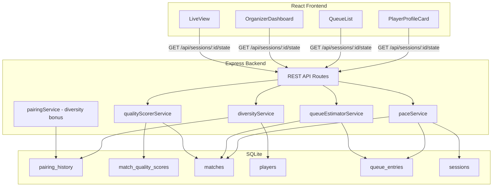

# Design Document: Session Intelligence

## Overview

Session Intelligence adds four analytics features to PickleStack that enrich the open play experience within a single session: **Matchup Diversity Score**, **Session Pace Dashboard**, **Next Game Countdown**, and **Match Quality Score**. These features provide players with visibility into matchup variety and queue wait times, while giving organizers real-time pacing projections and match quality metrics.

All features operate within the existing monolithic Express + SQLite architecture. Backend logic is encapsulated in new service modules that query existing tables (matches, pairing_history, players, queue_entries) plus one new table (match_quality_scores). Frontend components are added to existing pages (PlayerProfileCard, QueueList, OrganizerDashboard, LiveView) using the established polling pattern.

### Design Decisions

1. **No new microservices** — All computation runs in the same Node.js process. Session sizes (8–30 players, 6–20 matches) are small enough that all formulas complete in sub-millisecond time.
2. **Reuse pairing_history table** — The existing `pairing_history` table already tracks `times_as_teammates` and `times_as_opponents` per player pair per session, which provides the data needed for diversity scoring without schema changes.
3. **Persist match quality scores** — A new `match_quality_scores` table stores per-match quality ratings so the session summary can report them after a session ends, and so repeated polling doesn't recompute historical matches.
4. **Diversity bonus inserted into existing pairing algorithm** — The bonus slots between skill gap and teammate frequency sum in the `selectPairing` function's tiebreaker chain, matching the requirements' specified priority order.

## Architecture



### Data Flow

1. **Match Completion Trigger**: When a match is completed via `POST /api/sessions/:id/courts/:courtNumber/complete`, the existing flow updates match status, records results, and updates ratings. Session Intelligence hooks into this flow to:
   - Recompute diversity percentages for involved players (diversityService)
   - Compute and persist the match quality score (qualityScorerService)

2. **Polling Response Enrichment**: The existing `GET /api/sessions/:id/state` endpoint response is extended with session intelligence data computed on-the-fly:
   - Per-player diversity percentages
   - Per-queue-entry estimated wait times
   - Pace dashboard metrics (for organizer view)
   - Session quality score and recent match ratings

## Components and Interfaces

### Backend Services

#### diversityService

```typescript
/**
 * Computes the diversity percentage for a single player.
 * Formula: (uniqueOpponents + uniqueTeammates) / (2 × totalPossibleOpponents) × 100
 */
export function computeDiversityPercentage(
  sessionId: string,
  playerId: string
): number;

/**
 * Computes diversity percentages for all players in a session.
 * Returns a map of playerId -> percentage (integer 0-100).
 */
export function computeSessionDiversity(
  sessionId: string
): Map<string, number>;

/**
 * Calculates the diversity bonus for a candidate grouping.
 * Returns a value between 0.0 and 1.0 representing the ratio of
 * fresh opponent pairings to maximum possible fresh pairings.
 */
export function calculateDiversityBonus(
  playerIds: string[],
  sessionId: string
): number;
```

#### paceService

```typescript
export interface PaceMetrics {
  averageMatchDurationSeconds: number | null;
  pacingProjection: number | null;
  remainingMinutes: number;
  warningMessage: string | null;
  displayMessage: string;
}

/**
 * Computes session pace metrics for the organizer dashboard.
 * Returns null projection if fewer than 2 matches completed or no players checked in.
 */
export function computePaceMetrics(sessionId: string): PaceMetrics;
```

#### queueEstimatorService

```typescript
export interface WaitEstimate {
  playerId: string;
  estimatedMinutes: number | null;
}

/**
 * Computes estimated wait time for all queued players.
 * Returns null estimate if fewer than 2 matches completed or avg duration is zero.
 */
export function computeWaitEstimates(sessionId: string): WaitEstimate[];
```

#### qualityScorerService

```typescript
export interface MatchQuality {
  matchId: string;
  courtNumber: number;
  scoreClosenessScore: number;
  ratingBalanceScore: number;
  freshnessScore: number;
  matchQualityRating: number;
  hasScores: boolean;
}

export interface SessionQualityMetrics {
  sessionQualityScore: number | null;
  recentMatchRatings: Array<{ courtNumber: number; rating: number }>;
  totalMatchesRated: number;
}

/**
 * Computes and persists the quality rating for a completed match.
 */
export function computeMatchQuality(
  matchId: string,
  sessionId: string
): MatchQuality;

/**
 * Retrieves aggregate session quality metrics.
 */
export function getSessionQualityMetrics(sessionId: string): SessionQualityMetrics;
```

#### pairingService (modification)

The existing `selectPairing` function is modified to insert a diversity bonus tiebreaker between skill gap and teammate frequency sum:

```typescript
// Current order: skillGap → teammateFrequencySum → earliestQueuePosition
// New order:     skillGap → diversityBonus (desc) → teammateFrequencySum → earliestQueuePosition
```

The `TeamCombination` interface gains a `diversityBonus: number` field.

### Frontend Components

#### PlayerProfileCard (modification)

- Displays "Diversity: X%" with color coding (amber < 50%, green ≥ 50%)
- Shows "Diversity: 0%" when player has no completed matches

#### QueueList (modification)

- Displays diversity percentage "X%" next to each player name
- Displays wait estimate "You're up in ~N min" or "You're up next!" per entry
- Hides countdown when estimate is null

#### OrganizerDashboard (modification)

- New "Session Pace" card showing average match duration, pacing projection, and warnings
- New "Session Quality" card showing quality score with color indicators and recent match ratings

#### LiveView (modification)

- Displays estimated wait times next to queued players (same format as QueueList)

### API Response Extensions

The existing session state endpoint response is extended:

```typescript
// Added to GET /api/sessions/:id/state response
interface SessionStateExtensions {
  diversity: Record<string, number>;         // playerId → percentage
  waitEstimates: Record<string, number | null>; // playerId → minutes or null
  paceMetrics: PaceMetrics;
  qualityMetrics: SessionQualityMetrics;
}
```

## Data Models

### New Table: match_quality_scores

```sql
CREATE TABLE IF NOT EXISTS match_quality_scores (
  match_id TEXT PRIMARY KEY REFERENCES matches(id),
  session_id TEXT NOT NULL REFERENCES sessions(id),
  score_closeness_score INTEGER NOT NULL,
  rating_balance_score INTEGER NOT NULL,
  freshness_score INTEGER NOT NULL,
  match_quality_rating INTEGER NOT NULL,
  has_scores INTEGER NOT NULL DEFAULT 1,
  computed_at TEXT NOT NULL
);

CREATE INDEX IF NOT EXISTS idx_match_quality_session
  ON match_quality_scores(session_id);
```

### Existing Tables Used (no changes)

- **pairing_history**: `times_as_opponents` and `times_as_teammates` provide unique opponent/teammate counts per pair
- **matches**: `started_at`, `completed_at`, `status`, `player_ids` for duration calculations and freshness checks
- **match_results**: `team1_score`, `team2_score` for closeness calculation
- **player_ratings**: `rating` for balance calculation
- **players**: Player count for total_possible_opponents
- **queue_entries**: `position` for wait time estimation
- **sessions**: `created_at`, `court_count`, `game_mode` for pacing formula

### TypeScript Interfaces (new)

```typescript
/** Stored match quality rating */
export interface MatchQualityRow {
  match_id: string;
  session_id: string;
  score_closeness_score: number;
  rating_balance_score: number;
  freshness_score: number;
  match_quality_rating: number;
  has_scores: number;       // 0 or 1 (SQLite boolean)
  computed_at: string;
}
```

## Correctness Properties

*A property is a characteristic or behavior that should hold true across all valid executions of a system — essentially, a formal statement about what the system should do. Properties serve as the bridge between human-readable specifications and machine-verifiable correctness guarantees.*

### Property 1: Diversity percentage bounded 0-100

*For any* session with one or more players, the computed diversity percentage for every player SHALL be an integer in the range [0, 100] inclusive.

**Validates: Requirements 1.1, 1.4, 1.6**

### Property 2: Diversity percentage monotonically non-decreasing with new unique opponents/teammates

*For any* player in a session, after completing a match that includes at least one new unique opponent or teammate, the player's diversity percentage SHALL be greater than or equal to their previous diversity percentage.

**Validates: Requirements 1.1, 1.2, 1.3**

### Property 3: Diversity counts distinct players exactly once

*For any* player who has faced the same opponent N times (N > 1) across different matches, that opponent SHALL be counted exactly once in the unique opponent count; likewise for teammates.

**Validates: Requirements 1.2, 1.3**

### Property 4: Player appears in both sets when both teammate and opponent

*For any* player A and player B in the same session, if A has been B's teammate in one match and B's opponent in another match, then B SHALL appear in both A's unique teammate set and A's unique opponent set simultaneously.

**Validates: Requirements 1.7**

### Property 5: New check-in resets to zero and adjusts totals

*For any* session, when a new player checks in with zero matches played, their diversity percentage SHALL be 0, and every existing player's Total_Possible_Opponents SHALL increase by 1.

**Validates: Requirements 1.4, 1.5**

### Property 6: Diversity bonus bounded [0, 1]

*For any* candidate grouping of players in a session, the diversity bonus SHALL be a value between 0.0 and 1.0 inclusive, computed as fresh opponent pairings divided by maximum possible fresh pairings.

**Validates: Requirements 3.2**

### Property 7: Diversity bonus as correct tiebreaker priority

*For any* two candidate groupings with equal skill gap scores, the pairing algorithm SHALL select the grouping with the higher diversity bonus; the teammate frequency sum tiebreaker SHALL only apply when diversity bonuses are also equal.

**Validates: Requirements 3.1, 3.3**

### Property 8: Wait estimate formula consistency

*For any* queued player at position P in a session with C courts, M players per match, and average match duration D (where at least 2 matches completed and D > 0), the estimated wait time in minutes SHALL equal `ceil(P / (C × M)) × D` rounded to the nearest whole minute, with a minimum of 1 minute.

**Validates: Requirements 5.1, 5.4**

### Property 9: Wait estimate null conditions

*For any* session where fewer than 2 matches have been completed OR the average match duration is zero, the wait estimate for every queued player SHALL be null.

**Validates: Requirements 5.2, 5.5**

### Property 10: Match quality rating bounded 0-100

*For any* completed match with recorded scores, the Match_Quality_Rating SHALL be an integer in the range [0, 100] inclusive, computed as the weighted sum: Score_Closeness_Score × 0.40 + Rating_Balance_Score × 0.35 + Freshness_Score × 0.25.

**Validates: Requirements 7.1, 7.5**

### Property 11: Score closeness formula correctness

*For any* completed match with team scores T1 and T2, the Score_Closeness_Score SHALL equal `max(0, 100 - |T1 - T2| × 10)`.

**Validates: Requirements 7.2**

### Property 12: Match quality without scores uses reduced formula

*For any* completed match without recorded scores (winner-only result), the Match_Quality_Rating SHALL be computed using only Rating_Balance_Score (60% weight) and Freshness_Score (40% weight), clamped to [0, 100].

**Validates: Requirements 7.6**

### Property 13: Session quality score is arithmetic mean

*For any* session with N rated matches (N ≥ 1), the Session_Quality_Score SHALL equal the arithmetic mean of all N Match_Quality_Rating values, rounded to the nearest integer.

**Validates: Requirements 8.1**

### Property 14: Pacing projection formula consistency

*For any* active session with at least 2 completed matches, non-zero remaining time, and at least one checked-in player, the Pacing_Projection SHALL equal `floor(remaining_time_minutes / Average_Match_Duration × Court_Count / ceil(Total_Players / Players_Per_Match))` rounded to the nearest integer.

**Validates: Requirements 4.2, 4.3**

## Error Handling

| Scenario | Behavior |
|----------|----------|
| Single player in session (Total_Possible_Opponents = 0) | Diversity returns 0, skips formula (Req 1.6) |
| Fewer than 2 completed matches | Pace shows "Not enough data yet"; wait estimates return null (Req 4.4, 5.2) |
| Zero remaining session time | Pace projection = 0 with warning indicator (Req 4.7) |
| Zero players checked in | Pace shows "No players checked in" (Req 4.8) |
| Average match duration = 0 | Wait estimate returns null (Req 5.5) |
| Match completed without scores | Quality scorer uses reduced formula without closeness (Req 7.6) |
| No rated matches in session | Session quality shows "N/A" (Req 8.7) |
| Player not in queue | No wait estimate computed |
| Pairing mode is "queue" (not "smart") | Diversity bonus skipped entirely |
| All groupings have diversity bonus 0.0 | Algorithm skips diversity tiebreaker, falls through (Req 3.5) |

All new service functions are pure computations over database state — they do not throw on edge cases but return safe defaults (0, null, "N/A") as specified in requirements. Existing error middleware handles unexpected failures.

## Testing Strategy

### Unit Tests (example-based)

- **diversityService**: Concrete scenarios — 1 player (returns 0), 2 players after 1 match (50%), player as both teammate and opponent
- **paceService**: Scenarios for < 2 matches, zero remaining time, typical 4-court session
- **queueEstimatorService**: Position 1 vs position 8, singles vs doubles mode
- **qualityScorerService**: Perfect match (11-9 score, equal ratings, fresh), blowout match (11-0), no-score match
- **UI components**: Render tests for color coding thresholds, countdown text formatting

### Property-Based Tests (fast-check, minimum 100 iterations)

Property-based testing is appropriate here because the core features are **pure computational functions** with clear input/output behavior, large input spaces (varying player counts, match histories, scores), and universal invariants.

**Library**: `fast-check` (already used in both client and server workspaces)

**Server-side properties** (vitest + fast-check):
- Properties 1–6: diversityService — generate random sessions with varying player counts and match histories
- Properties 7: pairingService — generate candidate pools and verify tiebreaker ordering
- Properties 8–9: queueEstimatorService — generate queue states and verify formula
- Properties 10–12: qualityScorerService — generate match scores and ratings
- Properties 13: Session quality aggregation
- Property 14: paceService — generate session timing scenarios

**Test configuration**:
- Each property test runs minimum 100 iterations
- Each test tagged with: `Feature: session-intelligence, Property {N}: {title}`
- Generators produce valid sessions (1–30 players), valid scores (0–15 per team), valid ratings (100–3000), valid queue positions

### Integration Tests

- End-to-end match completion flow triggers diversity recomputation and quality scoring
- Session state endpoint returns enriched response with all intelligence fields
- Pairing with diversity bonus selects fresher matchups over repeated ones

### UI Tests (React Testing Library)

- PlayerProfileCard renders correct color for diversity thresholds
- QueueList shows countdown text at correct breakpoints
- OrganizerDashboard displays pace warnings when projection < 6
- Session quality color indicators match score thresholds (green ≥ 70, amber 40–69, red < 40)
