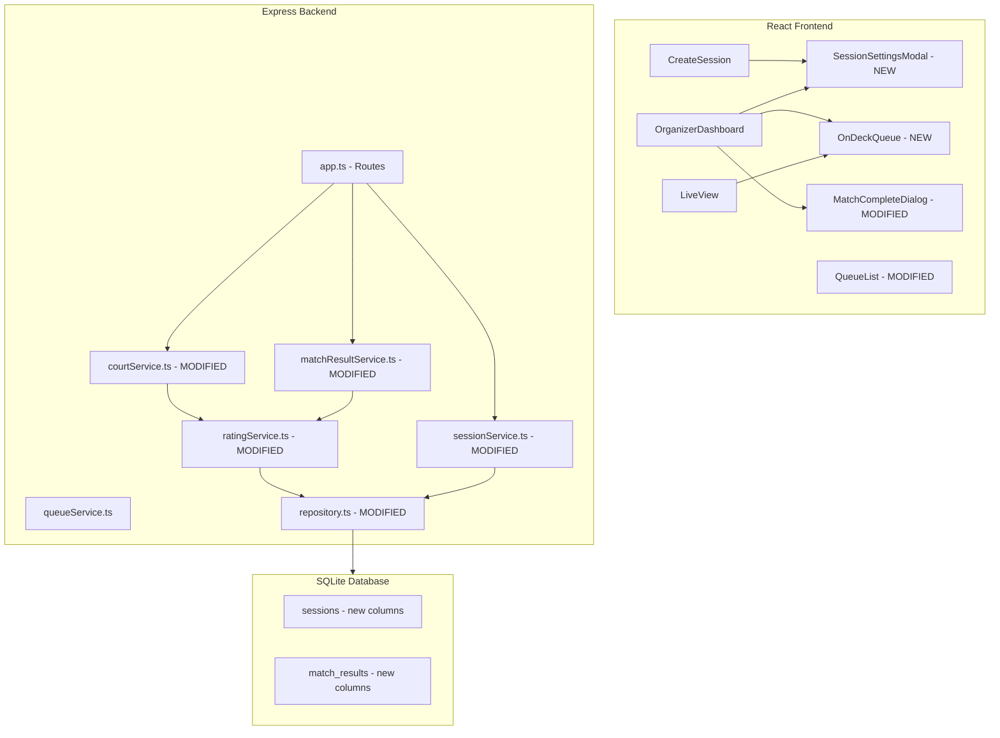

# Design Document: Session Settings & On Deck Queue

## Overview

This feature extends the Picklestack app with three capabilities:

1. **Session Settings Modal** — a comprehensive settings dialog shown after session creation that captures session type, game mode, matching mode, and court name. This replaces the current minimal creation flow (name + court count only) with a richer configuration step.
2. **Numeric Score Input** — replaces the binary "winning team" selection with actual game scores (e.g., 11-7). The score margin scales the existing Elo-like rating adjustment using the formula `min(1 + margin/20, 2.0)`.
3. **On Deck Queue Display** — a visible indicator showing which players are next to be matched, giving players clear visibility into when they'll play next. The count varies by game mode and matching mode.

The existing rating system (Elo-like, base 16 points, range 100-3000, scale factor based on team rating difference) remains unchanged. The score margin multiplier is applied on top of the existing adjustment calculation.

The design preserves the existing architecture (Express + better-sqlite3 backend, React + Vite frontend) and modifies existing service modules, database tables, and API endpoints.

## Architecture



### Key Architectural Decisions

1. **Session Settings Modal as a separate component** — keeps the CreateSession page simple (just name + court count for initial persistence) and adds a modal step for detailed configuration. The modal is also reusable from the OrganizerDashboard for editing settings mid-session.

2. **Score margin multiplier applied in existing `calculateRatingAdjustment`** — rather than creating a new function, the existing pure function gains an optional `scoreMargin` parameter. This keeps the rating logic centralized and testable.

3. **On Deck calculation is a pure function** — given a queue, game mode, and matching mode, it returns the set of "on deck" player IDs. No database access needed; it operates on the queue state already fetched.

4. **Database schema additions are additive** — new columns on `sessions` and `match_results` tables with defaults, so existing data remains valid without migration scripts.

5. **Game mode affects player count per match** — the `courtService.startMatch` function reads the session's `game_mode` to determine whether to pull 2 or 4 players from the queue.

## Components and Interfaces

### New Client Components

#### `SessionSettingsModal.tsx`

```typescript
interface SessionSettingsModalProps {
  sessionId: string;
  initialSettings: SessionSettings;
  onConfirm: (settings: SessionSettings) => void;
  onClose?: () => void;  // undefined when shown post-creation (no close allowed)
  showPlayerCheckIn?: boolean;
}

interface SessionSettings {
  name: string;           // 1-50 chars
  courtCount: number;     // 1-12
  courtName: string;      // 0-50 chars, optional
  sessionType: 'tournament' | 'open_play';
  gameMode: 'doubles' | 'singles';
  matchingMode: 'queue' | 'smart' | 'tournament' | 'skill_courts';
}
```

#### `OnDeckQueue.tsx`

```typescript
interface OnDeckQueueProps {
  queue: QueueEntry[];
  gameMode: 'doubles' | 'singles';
  matchingMode: 'queue' | 'smart' | 'tournament' | 'skill_courts';
}
```

### Modified Server Services

#### `ratingService.ts` — Modified `calculateRatingAdjustment`

```typescript
/**
 * Calculates the rating adjustment for a match result.
 * Now accepts an optional scoreMargin parameter.
 *
 * Formula:
 *   scaleFactor = clamp(1.0 - (winnerAvg - loserAvg) / 400, 0.5, 1.5)
 *   marginMultiplier = min(1 + scoreMargin / 20, 2.0)  // only if scoreMargin provided
 *   adjustment = round(basePoints * scaleFactor * marginMultiplier)
 */
export function calculateRatingAdjustment(
  winnerAvgRating: number,
  loserAvgRating: number,
  basePoints?: number,
  scoreMargin?: number
): { winnerGain: number; loserLoss: number };
```

#### `sessionService.ts` — New `updateSessionSettings`

```typescript
export interface SessionSettingsUpdate {
  name: string;
  courtCount: number;
  courtName?: string;
  sessionType: 'tournament' | 'open_play';
  gameMode: 'doubles' | 'singles';
  matchingMode: 'queue' | 'smart' | 'tournament' | 'skill_courts';
}

/** Update session settings (post-creation or mid-session edit) */
export function updateSessionSettings(sessionId: string, settings: SessionSettingsUpdate): void;

/** Get session settings */
export function getSessionSettings(sessionId: string): SessionSettingsUpdate;
```

#### `matchResultService.ts` — Modified `recordMatchResult`

```typescript
export interface MatchResultInput {
  matchId: string;
  sessionId: string;
  winningTeam: 'team1' | 'team2';
  team1Score?: number;  // NEW: numeric score for team 1
  team2Score?: number;  // NEW: numeric score for team 2
}
```

#### `courtService.ts` — Modified `startMatch`

The `startMatch` function reads `session.game_mode` to determine:
- `'doubles'` → requires 4 players in queue, selects 4
- `'singles'` → requires 2 players in queue, selects 2

### New/Modified API Endpoints

| Method | Path | Description |
|--------|------|-------------|
| PUT | `/api/sessions/:sessionId/settings` | **NEW** — Update session settings |
| GET | `/api/sessions/:sessionId/settings` | **NEW** — Get session settings |
| POST | `/api/sessions/:sessionId/courts/:courtNumber/complete` | **MODIFIED** — accepts `{ team1Score, team2Score }` or `{ skip: true }` |

### Pure Utility Functions

#### `getOnDeckPlayerIds`

```typescript
/**
 * Determines which players are "On Deck" based on queue state, game mode, and matching mode.
 *
 * Rules:
 * - Queue mode + Doubles: first 4 (or all if < 4)
 * - Queue mode + Singles: first 2 (or all if < 2)
 * - Smart Pairing: first min(N, 8) (candidate pool)
 * - Tournament/Skill Courts: first 4 for doubles, first 2 for singles
 *
 * Returns the player IDs that should be marked as "On Deck".
 */
export function getOnDeckPlayerIds(
  queue: { playerId: string; position: number }[],
  gameMode: 'doubles' | 'singles',
  matchingMode: 'queue' | 'smart' | 'tournament' | 'skill_courts'
): string[];
```

#### `validateScores`

```typescript
/**
 * Validates match scores.
 * Returns { valid: true, winner: 'team1' | 'team2' } or { valid: false, error: string }
 */
export function validateScores(
  team1Score: number,
  team2Score: number
): { valid: true; winner: 'team1' | 'team2' } | { valid: false; error: string };
```

#### `calculateMarginMultiplier`

```typescript
/**
 * Calculates the score margin multiplier for rating adjustment.
 * Formula: min(1 + scoreMargin / 20, 2.0)
 * scoreMargin = abs(team1Score - team2Score)
 */
export function calculateMarginMultiplier(scoreMargin: number): number;
```

#### `formatMatchScore`

```typescript
/**
 * Formats a match score for display.
 * Returns "11-7" format (winner score first) or "No Score" if scores are null.
 */
export function formatMatchScore(
  team1Score: number | null,
  team2Score: number | null
): string;
```

#### `validateSessionSettings`

```typescript
/**
 * Validates session settings fields.
 * Returns { valid: true } or { valid: false, errors: Record<string, string> }
 */
export function validateSessionSettings(settings: SessionSettings): ValidationResult;
```

## Data Models

### Modified Database Tables

```sql
-- Add new columns to sessions table
ALTER TABLE sessions ADD COLUMN court_name TEXT DEFAULT '';
ALTER TABLE sessions ADD COLUMN session_type TEXT NOT NULL DEFAULT 'open_play';
-- Values: 'tournament' | 'open_play'
ALTER TABLE sessions ADD COLUMN game_mode TEXT NOT NULL DEFAULT 'doubles';
-- Values: 'doubles' | 'singles'
ALTER TABLE sessions ADD COLUMN matching_mode TEXT NOT NULL DEFAULT 'smart';
-- Values: 'queue' | 'smart' | 'tournament' | 'skill_courts'
-- Note: existing pairing_mode column is superseded by matching_mode

-- Add score columns to match_results table
ALTER TABLE match_results ADD COLUMN team1_score INTEGER DEFAULT NULL;
ALTER TABLE match_results ADD COLUMN team2_score INTEGER DEFAULT NULL;
```

### New/Modified TypeScript Types

```typescript
/** Session type */
export type SessionType = 'tournament' | 'open_play';

/** Game mode determining players per match */
export type GameMode = 'doubles' | 'singles';

/** Matching mode for player assignment */
export type MatchingMode = 'queue' | 'smart' | 'tournament' | 'skill_courts';

/** Extended session settings */
export interface SessionSettings {
  name: string;
  courtCount: number;
  courtName: string;
  sessionType: SessionType;
  gameMode: GameMode;
  matchingMode: MatchingMode;
}

/** Match result with optional scores */
export interface MatchResultWithScore extends MatchResult {
  team1Score: number | null;
  team2Score: number | null;
}
```

### Rating Calculation with Score Margin

The existing formula:
```
ratingDiff = (winnerTeamAvg - loserTeamAvg) / 400
scaleFactor = clamp(1.0 - ratingDiff, 0.5, 1.5)
adjustment = round(BASE_POINTS * scaleFactor)
```

Becomes (when scores are provided):
```
ratingDiff = (winnerTeamAvg - loserTeamAvg) / 400
scaleFactor = clamp(1.0 - ratingDiff, 0.5, 1.5)
marginMultiplier = min(1 + scoreMargin / 20, 2.0)
adjustment = round(BASE_POINTS * scaleFactor * marginMultiplier)
```

When scores are skipped, `marginMultiplier = 1.0` (no change from current behavior).

**Examples:**
- Score 11-9 → margin 2 → multiplier 1.1 → base 16 × 1.1 = ~18 points (before scale factor)
- Score 11-3 → margin 8 → multiplier 1.4 → base 16 × 1.4 = ~22 points
- Score 21-1 → margin 20 → multiplier 2.0 (capped) → base 16 × 2.0 = 32 points
- Score 11-10 → margin 1 → multiplier 1.05 → base 16 × 1.05 = ~17 points

### On Deck Logic

```
if matchingMode == 'smart':
    onDeckCount = min(queueLength, 8)  // entire candidate pool
else if gameMode == 'doubles':
    onDeckCount = min(queueLength, 4)
else:  // singles
    onDeckCount = min(queueLength, 2)

onDeckPlayers = queue[0..onDeckCount-1]
```

When the queue has fewer players than needed for a match, all players are marked On Deck and a "more players needed" message is shown.

## Correctness Properties

*A property is a characteristic or behavior that should hold true across all valid executions of a system — essentially, a formal statement about what the system should do. Properties serve as the bridge between human-readable specifications and machine-verifiable correctness guarantees.*

### Property 1: Session settings persistence round-trip

*For any* valid session settings (name 1-50 chars, court count 1-12, court name 0-50 chars, any valid session type, game mode, and matching mode), persisting the settings and then retrieving them SHALL return identical values for all fields.

**Validates: Requirements 1.4**

### Property 2: Session settings validation correctness

*For any* string `name`, number `courtCount`, and string `courtName`: the validation function SHALL accept the input if and only if `name.trim().length` is between 1 and 50 inclusive, `courtCount` is an integer between 1 and 12 inclusive, and `courtName.length` is between 0 and 50 inclusive.

**Validates: Requirements 1.5**

### Property 3: Singles mode player count

*For any* session with game mode "singles" and a queue of N ≥ 2 players, starting a match SHALL select exactly 2 players from the queue. For any session with game mode "doubles" and a queue of N ≥ 4 players, starting a match SHALL select exactly 4 players.

**Validates: Requirements 1.8**

### Property 4: Winner determination from scores

*For any* pair of non-negative integers (team1Score, team2Score) where team1Score ≠ team2Score, the winner determination function SHALL return "team1" if team1Score > team2Score, and "team2" if team2Score > team1Score.

**Validates: Requirements 3.2**

### Property 5: Score validation

*For any* pair of numbers (team1Score, team2Score), the validation function SHALL accept the input if and only if both are non-negative integers and they are not equal. Equal scores SHALL be rejected with an error message.

**Validates: Requirements 3.3, 3.4**

### Property 6: Score persistence round-trip

*For any* valid match with valid scores (non-negative integers, not equal), recording the match result with scores and then retrieving it SHALL return the same team1Score and team2Score values alongside the correct winner/loser player IDs.

**Validates: Requirements 3.6**

### Property 7: Score margin rating adjustment

*For any* valid score margin (non-negative integer), the margin multiplier SHALL equal `min(1 + margin / 20, 2.0)`. Furthermore, for any valid team ratings and score margin, the rating adjustment SHALL equal `round(BASE_POINTS * scaleFactor * marginMultiplier)` where scaleFactor is the existing Elo scale factor. The adjustment SHALL always be between `round(16 * 0.5 * 1.0)` = 8 and `round(16 * 1.5 * 2.0)` = 48 inclusive.

**Validates: Requirements 3.9**

### Property 8: On Deck calculation correctness

*For any* queue of N players, game mode, and matching mode:
- If matching mode is "smart": the On Deck set SHALL contain exactly `min(N, 8)` players, being the first `min(N, 8)` by queue position.
- If matching mode is not "smart" and game mode is "doubles": the On Deck set SHALL contain exactly `min(N, 4)` players, being the first `min(N, 4)` by queue position.
- If matching mode is not "smart" and game mode is "singles": the On Deck set SHALL contain exactly `min(N, 2)` players, being the first `min(N, 2)` by queue position.

In all cases, the On Deck set SHALL be a prefix of the queue ordered by position.

**Validates: Requirements 4.2, 4.4, 4.5, 4.6, 4.8**

## Error Handling

| Scenario | HTTP Status | Error Message | Recovery |
|----------|-------------|---------------|----------|
| Session settings with invalid name (empty or >50 chars) | 400 | "Session name must be 1-50 characters" | Preserve current settings |
| Session settings with invalid court count | 400 | "Court count must be between 1 and 12" | Preserve current settings |
| Session settings with invalid court name (>50 chars) | 400 | "Court name must be 0-50 characters" | Preserve current settings |
| Match completion with equal scores | 400 | "Scores cannot be tied" | Preserve match in active state |
| Match completion with negative score | 400 | "Scores must be non-negative integers" | Preserve match in active state |
| Match completion with non-integer score | 400 | "Scores must be non-negative integers" | Preserve match in active state |
| Start match in singles mode with < 2 players | 422 | "Not enough players in queue to start a match (minimum 2 required)" | No state change |
| Start match in doubles mode with < 4 players | 422 | "Not enough players in queue to start a match (minimum 4 required)" | No state change |
| Update settings on ended session | 403 | "Cannot update settings after session has ended" | No state change |
| Duplicate player name in check-in | 409 | "A player with this name already exists in this session" | No state change |

All errors follow the existing pattern: `ValidationError` and `NotFoundError` classes mapped to appropriate HTTP status codes by the error handling middleware in `app.ts`.

## Testing Strategy

### Property-Based Tests (using fast-check + vitest)

The project already has `fast-check` installed. Each correctness property maps to a property-based test with minimum 100 iterations.

**Target modules for PBT:**
- `validateSessionSettings` — Property 2 (pure validation function)
- `calculateRatingAdjustment` with score margin — Property 7 (pure calculation)
- `calculateMarginMultiplier` — Property 7 (pure calculation)
- `validateScores` — Properties 4, 5 (pure validation/determination)
- `getOnDeckPlayerIds` — Property 8 (pure function of queue state)
- Session settings persistence — Properties 1, 6 (round-trip with in-memory DB)
- `courtService.startMatch` with game mode — Property 3 (player count invariant)

**Configuration:**
- Minimum 100 iterations per property test (`fc.assert(property, { numRuns: 100 })`)
- Each test tagged with: `// Feature: session-settings-mmr, Property N: <title>`
- Custom arbitraries for: session settings (valid/invalid combinations), score pairs, queue states, game modes, matching modes

### Unit Tests (example-based)

- Session Settings Modal renders all fields with correct defaults
- Session Settings Modal shows validation errors for invalid inputs
- Match completion dialog shows score input fields
- Score display formatting ("11-7", "No Score")
- On Deck badge rendering in queue list
- Player check-in through settings modal
- Settings edit from organizer dashboard
- Singles mode match start with 2 players

### Integration Tests

- Full flow: create session → settings modal → configure → dashboard
- Match lifecycle with scores: start → complete with scores → verify rating adjusted with margin
- Match lifecycle without scores: start → skip → verify rating unchanged
- Settings update mid-session
- On Deck indicators update after match start/complete
- API endpoint contract tests for new/modified endpoints

### Test File Organization

```
server/src/services/
  ratingService.test.ts        — Property 7 + existing tests
  sessionService.test.ts       — Properties 1, 2 + unit tests
  matchResultService.test.ts   — Properties 4, 5, 6 + unit tests
  courtService.test.ts         — Property 3 + unit tests
server/src/
  onDeck.test.ts               — Property 8 + unit tests
  app.test.ts                  — Integration tests for new/modified endpoints
client/src/components/
  SessionSettingsModal.test.tsx — UI unit tests
  OnDeckQueue.test.tsx          — UI unit tests
```
