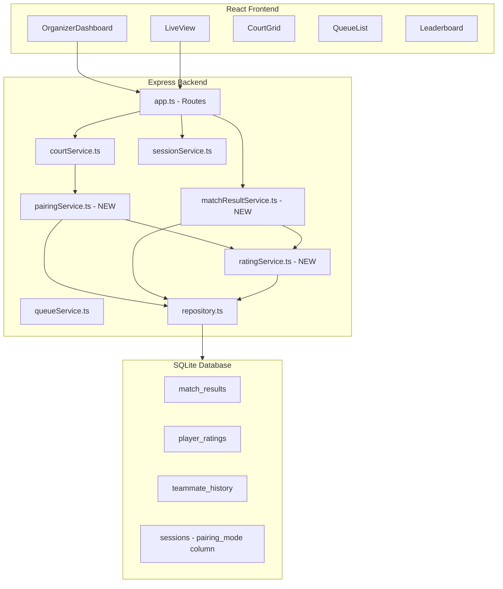

# Design Document: Smart Match Scoring

## Overview

Smart Match Scoring extends the Picklestack pickleball queue management app with match result tracking and a skill-based pairing algorithm. The current system uses strict FIFO ordering — always taking the top 4 players from the queue — which produces repetitive matchups and ignores skill differences. This feature introduces:

1. **Match score recording** — organizers designate a winning team when completing a match
2. **Player rating calculation** — an Elo-like system (base 16 points, starting at 1000) that adjusts after each match
3. **Skill-based pairing** — an algorithm that selects 4 players from a candidate pool (top 8 in queue) to minimize skill gap between teams
4. **Matchup variety tracking** — teammate/opponent frequency constraints to keep games fresh
5. **Player statistics display** — win/loss/rating shown on the live view
6. **Organizer pairing override** — toggle between Smart Pairing and Queue Order modes
7. **Session summary leaderboard** — ranked player performance data when a session ends

The design preserves the existing architecture (Express + better-sqlite3 backend, React + Vite frontend) and adds new service modules, database tables, and API endpoints.

## Architecture



### Key Architectural Decisions

1. **New service modules** rather than expanding existing ones — `ratingService`, `pairingService`, and `matchResultService` keep concerns separated and testable.
2. **Pairing logic is pure** — the `pairingService` takes player data and history as inputs and returns a selection. This makes it straightforward to property-test without database dependencies.
3. **Rating calculation is deterministic** — given two team averages and a base adjustment, the output is a pure function. This is ideal for property-based testing.
4. **Database-level tracking** — teammate/opponent history is stored in a dedicated table rather than computed on-the-fly from match history, for efficient lookup during pairing.

## Components and Interfaces

### New Server Services

#### `ratingService.ts`

```typescript
/** Calculate rating adjustment for a match result */
export function calculateRatingAdjustment(
  winnerAvgRating: number,
  loserAvgRating: number,
  basePoints: number // 16
): { winnerGain: number; loserLoss: number };

/** Apply rating changes after a match result */
export function applyMatchResult(
  sessionId: string,
  winnerIds: [string, string],
  loserIds: [string, string]
): void;

/** Get a player's current rating in a session */
export function getPlayerRating(sessionId: string, playerId: string): number;

/** Get all player ratings for a session */
export function getSessionRatings(sessionId: string): Map<string, number>;
```

#### `pairingService.ts`

```typescript
export interface PairingInput {
  candidatePool: { playerId: string; rating: number; queuePosition: number }[];
  teammateHistory: Map<string, Map<string, number>>; // playerId -> (partnerId -> count)
  opponentHistory: Map<string, Map<string, number>>; // playerId -> (opponentId -> count)
  matchConfigHistory: Set<string>; // serialized "team1-vs-team2" keys
}

export interface PairingResult {
  team1: [string, string]; // player IDs
  team2: [string, string]; // player IDs
}

/** Select 4 players and form teams from the candidate pool */
export function selectPairing(input: PairingInput): PairingResult;

/** Calculate skill gap between two teams */
export function calculateSkillGap(
  team1Ratings: [number, number],
  team2Ratings: [number, number]
): number;
```

#### `matchResultService.ts`

```typescript
export interface MatchResultInput {
  matchId: string;
  sessionId: string;
  winningTeam: 'team1' | 'team2'; // team1 = players[0,1], team2 = players[2,3]
}

/** Record a match result with winner designation */
export function recordMatchResult(input: MatchResultInput): void;

/** Update an existing match result's winner */
export function updateMatchResult(matchId: string, winningTeam: 'team1' | 'team2'): void;

/** Get match result for a specific match */
export function getMatchResult(matchId: string): MatchResult | null;

/** Get all match results for a session */
export function getSessionMatchResults(sessionId: string): MatchResult[];

/** Get player statistics for a session */
export function getPlayerStats(sessionId: string): PlayerStats[];
```

### New API Endpoints

| Method | Path | Description |
|--------|------|-------------|
| POST | `/api/sessions/:sessionId/courts/:courtNumber/complete` | Modified — accepts `{ winningTeam: 'team1' \| 'team2' }` or `{ skip: true }` |
| PUT | `/api/sessions/:sessionId/matches/:matchId/result` | Update a previously recorded match result |
| GET | `/api/sessions/:sessionId/stats` | Get player statistics for the session |
| PUT | `/api/sessions/:sessionId/pairing-mode` | Toggle pairing mode (`{ mode: 'smart' \| 'queue' }`) |
| GET | `/api/sessions/:sessionId/leaderboard` | Get session leaderboard (available after session ends) |

### Modified Components

- **`CourtGrid.tsx`** — match completion now shows team selection UI (Team 1 / Team 2 / Skip Score)
- **`QueueList.tsx`** — displays player rating and win/loss stats next to names
- **`LiveView.tsx`** — shows player stats in queue and court displays; shows leaderboard when session ended
- **`OrganizerDashboard.tsx`** — adds pairing mode toggle; shows leaderboard when session ended

### New Components

- **`MatchCompleteDialog.tsx`** — modal for selecting winning team or skipping score
- **`PlayerStatsDisplay.tsx`** — reusable component showing rating, wins, losses, win rate
- **`Leaderboard.tsx`** — session summary table with rankings
- **`PairingModeToggle.tsx`** — toggle switch between Smart Pairing and Queue Order

## Data Models

### New Database Tables

```sql
-- Match results with winner designation
CREATE TABLE IF NOT EXISTS match_results (
  id TEXT PRIMARY KEY,
  match_id TEXT NOT NULL REFERENCES matches(id),
  session_id TEXT NOT NULL REFERENCES sessions(id),
  winner_player_ids TEXT NOT NULL,  -- JSON array of 2 player IDs
  loser_player_ids TEXT NOT NULL,   -- JSON array of 2 player IDs
  recorded_at TEXT NOT NULL,
  updated_at TEXT NOT NULL
);

-- Player ratings within a session
CREATE TABLE IF NOT EXISTS player_ratings (
  player_id TEXT NOT NULL REFERENCES players(id),
  session_id TEXT NOT NULL REFERENCES sessions(id),
  rating INTEGER NOT NULL DEFAULT 1000,
  matches_played INTEGER NOT NULL DEFAULT 0,
  wins INTEGER NOT NULL DEFAULT 0,
  losses INTEGER NOT NULL DEFAULT 0,
  PRIMARY KEY (player_id, session_id)
);

-- Teammate/opponent pairing history within a session
CREATE TABLE IF NOT EXISTS pairing_history (
  session_id TEXT NOT NULL REFERENCES sessions(id),
  player1_id TEXT NOT NULL,
  player2_id TEXT NOT NULL,
  times_as_teammates INTEGER NOT NULL DEFAULT 0,
  times_as_opponents INTEGER NOT NULL DEFAULT 0,
  PRIMARY KEY (session_id, player1_id, player2_id)
);
```

### Modified Tables

```sql
-- Add pairing_mode column to sessions
ALTER TABLE sessions ADD COLUMN pairing_mode TEXT NOT NULL DEFAULT 'smart';
-- Values: 'smart' | 'queue'
```

### New TypeScript Types

```typescript
/** Result of a completed match */
export interface MatchResult {
  id: string;
  matchId: string;
  sessionId: string;
  winnerPlayerIds: [string, string];
  loserPlayerIds: [string, string];
  recordedAt: Date;
  updatedAt: Date;
}

/** Player rating within a session */
export interface PlayerRating {
  playerId: string;
  sessionId: string;
  rating: number;        // 100-3000, starts at 1000
  matchesPlayed: number;
  wins: number;
  losses: number;
}

/** Player statistics for display */
export interface PlayerStats {
  playerId: string;
  playerName: string;
  rating: number;
  wins: number;
  losses: number;
  matchesPlayed: number;
  winRate: number;       // 0-100 percentage
}

/** Leaderboard entry for session summary */
export interface LeaderboardEntry extends PlayerStats {
  rank: number;
}

/** Pairing mode for a session */
export type PairingMode = 'smart' | 'queue';
```

### Rating Calculation Formula

The Elo-like rating adjustment:

```
ratingDiff = (winnerTeamAvg - loserTeamAvg) / 400
scaleFactor = clamp(1.0 - ratingDiff, 0.5, 1.5)
adjustment = round(basePoints * scaleFactor)  // basePoints = 16

winnerNewRating = clamp(winnerRating + adjustment, 100, 3000)
loserNewRating = clamp(loserRating - adjustment, 100, 3000)
```

- When a lower-rated team wins: `scaleFactor > 1.0` → larger gain
- When a higher-rated team wins: `scaleFactor < 1.0` → smaller gain
- Equal teams: `scaleFactor = 1.0` → exactly 16 points exchanged

### Pairing Algorithm Steps

1. Build candidate pool (top 8 in queue, or all if < 8)
2. If all candidates have rating 1000 (no match history), select 4 randomly
3. Enumerate all C(n,4) selections of 4 players from pool
4. For each selection, enumerate all 3 possible team splits (ways to divide 4 into 2+2)
5. Filter out combinations violating teammate repetition threshold (>2 times as teammates, unless all exceed)
6. Filter out combinations violating exact matchup repetition (same 4 in same config, unless all exceed)
7. Score remaining combinations by minimum skill gap
8. Break ties by lowest same-team frequency sum
9. Break remaining ties by earliest queue position among selected players
10. Return the winning combination


## Correctness Properties

*A property is a characteristic or behavior that should hold true across all valid executions of a system — essentially, a formal statement about what the system should do. Properties serve as the bridge between human-readable specifications and machine-verifiable correctness guarantees.*

### Property 1: Match result round-trip persistence

*For any* match with 4 valid player IDs and any winning team designation (team1 or team2), recording the match result and then retrieving it SHALL return the same winner player IDs, loser player IDs, and the correct team mapping (team1 = players[0,1], team2 = players[2,3]).

**Validates: Requirements 1.2**

### Property 2: Rating adjustment bounds and direction

*For any* two team average ratings (each in [100, 3000]), the rating adjustment produced by `calculateRatingAdjustment` SHALL satisfy: (a) the adjustment is between 8 and 24 inclusive (basePoints × [0.5, 1.5]), (b) winners gain exactly the computed adjustment, and (c) losers lose exactly the computed adjustment. Furthermore, when the winning team has a lower average rating, the adjustment SHALL be greater than 16, and when the winning team has a higher average rating, the adjustment SHALL be less than 16.

**Validates: Requirements 2.2, 2.3**

### Property 3: Rating bounds invariant

*For any* player with any starting rating in [100, 3000] and any sequence of match results (wins and losses against teams of any valid rating), the player's rating SHALL always remain within [100, 3000] after each adjustment.

**Validates: Requirements 2.4**

### Property 4: Candidate pool size

*For any* queue of length N ≥ 4, the candidate pool SHALL contain exactly min(N, 8) players, and those players SHALL be the first min(N, 8) players by queue position.

**Validates: Requirements 3.2**

### Property 5: Pairing optimality

*For any* candidate pool of 4–8 players with arbitrary ratings and pairing history, the combination selected by the Pairing Algorithm SHALL have a skill gap less than or equal to every other valid combination. Among combinations with equal minimum skill gap, the selected combination SHALL have a teammate frequency sum less than or equal to all alternatives. Among remaining ties, the selected combination SHALL include the player with the earliest queue position.

**Validates: Requirements 3.3, 3.4, 3.5**

### Property 6: Queue integrity after pairing

*For any* queue of N players (N ≥ 4) after the pairing algorithm selects 4 players, the remaining queue SHALL have exactly N − 4 entries with positions numbered contiguously from 0 to N − 5, preserving the relative order of unselected players.

**Validates: Requirements 3.8**

### Property 7: Pairing history accuracy

*For any* sequence of completed matches in a session, the recorded teammate count for each player pair SHALL equal the number of matches where those two players were on the same team, and the recorded opponent count SHALL equal the number of matches where those two players were on opposing teams.

**Validates: Requirements 4.1, 4.2**

### Property 8: Variety constraints

*For any* candidate pool and pairing history, if there exists at least one valid team combination where no player pair has been teammates more than 2 times, the algorithm SHALL NOT select a combination that exceeds this threshold. If all combinations exceed the threshold, the algorithm SHALL select the combination with the lowest maximum teammate count among its player pairs. Similarly, the algorithm SHALL NOT select a matchup where the same 4 players face each other in the same team configuration more than once, unless all alternatives also exceed this constraint.

**Validates: Requirements 4.3, 4.4, 4.5**

### Property 9: Queue order mode uses strict FIFO

*For any* session in "Queue Order" mode with a queue of N ≥ 4 players, starting a match SHALL always select the players at positions 0, 1, 2, and 3 regardless of their ratings or pairing history.

**Validates: Requirements 6.2**

### Property 10: Leaderboard sort correctness

*For any* set of player statistics, the leaderboard SHALL be sorted such that for any two adjacent entries (rank i, rank i+1): either entry i has a strictly higher win rate, or they have equal win rates and entry i has more total matches played, or they have equal win rates and equal matches played and entry i's name is alphabetically before or equal to entry i+1's name.

**Validates: Requirements 7.1**

### Property 11: Win rate calculation

*For any* player with W wins and L losses (W + L > 0), the win rate SHALL equal W / (W + L) × 100, rounded to one decimal place. For any player with 0 wins and 0 losses, the win rate SHALL be 0.0.

**Validates: Requirements 7.2**

## Error Handling

| Scenario | HTTP Status | Error Message | Recovery |
|----------|-------------|---------------|----------|
| Complete match without selecting winner or skip | 400 | "Must select a winning team or skip score" | Preserve match in active state |
| Update result for non-existent match | 404 | "Match not found" | No state change |
| Update result for match without a recorded result | 404 | "No result recorded for this match" | No state change |
| Update result after session ended | 403 | "Cannot update results after session has ended" | No state change |
| Start match with fewer than 4 in queue | 422 | "Not enough players in queue to start a match (minimum 4 required)" | No state change |
| Toggle pairing mode on ended session | 403 | "Cannot change pairing mode after session has ended" | No state change |
| Invalid pairing mode value | 400 | "Pairing mode must be 'smart' or 'queue'" | No state change |
| Get leaderboard for active session | 200 | Returns current standings (not an error) | N/A |

All errors follow the existing pattern: `ValidationError` and `NotFoundError` classes mapped to appropriate HTTP status codes by the error handling middleware in `app.ts`.

## Testing Strategy

### Property-Based Tests (using fast-check + vitest)

The project already has `fast-check` installed. Each correctness property maps to a property-based test with minimum 100 iterations.

**Target modules for PBT:**
- `ratingService.ts` — Properties 2, 3 (pure calculation functions)
- `pairingService.ts` — Properties 4, 5, 6, 8, 9 (pure selection logic)
- `matchResultService.ts` — Property 1 (round-trip with in-memory DB)
- Pairing history tracking — Property 7 (counting invariant)
- Leaderboard generation — Properties 10, 11 (pure sorting/formatting)

**Configuration:**
- Minimum 100 iterations per property test (`fc.assert(property, { numRuns: 100 })`)
- Each test tagged with: `// Feature: smart-match-scoring, Property N: <title>`
- Custom arbitraries for: player ratings (100–3000), candidate pools (4–8 players), pairing histories, match sequences

### Unit Tests (example-based)

- Match completion flow (team selection, skip score, validation)
- Default rating initialization (1000 for new players)
- Pairing mode toggle persistence
- Session summary with zero-match players
- UI component rendering (stats display, leaderboard, toggle)

### Integration Tests

- Full match lifecycle: start → complete with score → verify ratings updated → verify stats on live view
- Pairing mode switch mid-session
- Session end with leaderboard generation
- API endpoint contract tests (request/response shapes)

### Test File Organization

```
server/src/services/
  ratingService.test.ts        — Properties 2, 3 + unit tests
  pairingService.test.ts       — Properties 4, 5, 6, 7, 8, 9 + unit tests
  matchResultService.test.ts   — Property 1 + unit tests
  leaderboard.test.ts          — Properties 10, 11 + unit tests
server/src/
  app.test.ts                  — Integration tests for new endpoints
```
