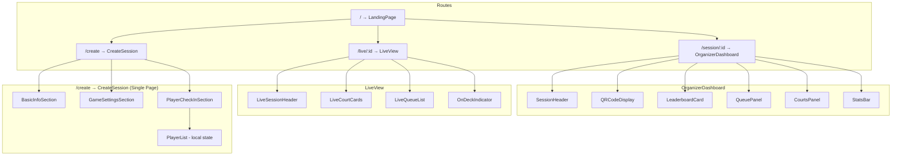

# Design Document: UI Polish and Features

## Overview

This design covers seven UI enhancements to the Picklestack application: a new Landing Page, QR code display for live view URLs, a real-time session leaderboard card, a Live View UI redesign, Dashboard UI polish, conditional hiding of the live view link for ended sessions, and a single-page session creation flow.

The changes are primarily client-side, affecting React components, routing, and CSS. The server requires no changes — all data needed is already available through existing API endpoints. The one new dependency is a client-side QR code generation library.

### Design Decisions

1. **QR Code Library**: Use `qrcode` (npm package) for client-side SVG generation. It supports configurable error correction levels, has zero server dependencies, and produces inline SVG output.
2. **Landing Page Route**: Move the current `CreateSession` form to `/create` and replace the root route (`/`) with the new `LandingPage` component.
3. **Leaderboard Card**: Implement as a new `LeaderboardCard` component separate from the existing full `Leaderboard` component. The card is a compact, collapsible view for active sessions.
4. **Live View Redesign**: Reuse existing components (`PlayerAvatar`, `CourtCard` pattern, `QueueList` pattern) to maintain design consistency without duplicating code.
5. **Styling Approach**: Continue using the existing CSS custom properties and BEM-style class naming conventions already established in `index.css`.
6. **Single-Page Session Creation**: Redesign `CreateSession` to collect all settings and players in one page, deferring session creation to the final submit. The `SessionSettingsModal` is no longer used in the creation flow (retained for editing from the dashboard). The submit orchestrates: create session → update settings → check in players → navigate.

## Architecture



### Data Flow

- **Landing Page**: Static content with optional statistics fetched from a future `/api/stats` endpoint (placeholder values initially).
- **QR Code**: Generated purely client-side from `window.location.origin + '/live/' + sessionId`. No API call needed.
- **Leaderboard Card**: Uses `playerStats` already returned by `GET /api/sessions/:id` response. Filtering and sorting happen client-side.
- **Live View**: Continues using the existing `GET /api/sessions/:id/live` endpoint with 3-second polling.
- **Conditional Link Hiding**: Uses the `session.status` field already present in the session state.
- **Single-Page Session Creation**: All data is collected in local component state. On submit, the page orchestrates three sequential API calls: `POST /api/sessions` (create), `PUT /api/sessions/:id/settings` (configure), then `POST /api/sessions/:id/players` for each player (check-in). No server call is made until the user clicks submit.

## Components and Interfaces

### New Components

#### `LandingPage`
- **Location**: `client/src/pages/LandingPage.tsx`
- **Props**: None
- **Responsibility**: Renders the marketing home page with hero, how-it-works, features, statistics, screenshots, and tagline sections. Each section includes a CTA button navigating to `/create`.

#### `QRCodeDisplay`
- **Location**: `client/src/components/QRCodeDisplay.tsx`
- **Props**:
  ```typescript
  interface QRCodeDisplayProps {
    url: string;        // The full URL to encode
    size?: number;      // Display size in pixels (default: 160)
  }
  ```
- **Responsibility**: Renders an inline SVG QR code using the `qrcode` library with high error correction level (level H).

#### `LeaderboardCard`
- **Location**: `client/src/components/LeaderboardCard.tsx`
- **Props**:
  ```typescript
  interface LeaderboardCardProps {
    playerStats: PlayerStats[];
    startingRatings?: Map<string, number>;  // For computing rating deltas
  }
  ```
- **Responsibility**: Displays a compact, collapsible leaderboard table for active sessions. Filters to players with ≥1 match, sorts by win rate desc → matches played desc → name asc. Shows rank, name, rating change, record, win rate, and current rating.

#### `LiveSessionHeader`
- **Location**: `client/src/components/LiveSessionHeader.tsx`
- **Props**:
  ```typescript
  interface LiveSessionHeaderProps {
    sessionName: string;
    activeCourts: number;
    queuedPlayers: number;
  }
  ```
- **Responsibility**: Renders the session name with a "LIVE" badge (pulse animation), active court count, and queued player count.

### Redesigned Components

#### `CreateSession` (Single-Page Session Creation)
- **Location**: `client/src/pages/CreateSession.tsx`
- **Props**: None (uses `useNavigate` from react-router-dom)
- **Responsibility**: Provides a single-page form for configuring all session settings and checking in players before creating the session on the server. Replaces the previous two-step flow (form → modal).

**Local State:**
```typescript
interface PendingPlayer {
  name: string;
  starRating: StarRating;
  localId: string;  // UUID for React key, generated client-side
}

interface CreateSessionFormState {
  // Basic Info
  name: string;                    // default: ''
  courtName: string;               // default: ''
  courtCount: number;              // default: 2

  // Game Settings
  sessionType: SessionType;        // default: 'open_play'
  gameMode: GameMode;              // default: 'doubles'
  matchingMode: MatchingMode;      // default: 'smart'

  // Player Check-In (local only, not sent until submit)
  pendingPlayers: PendingPlayer[];

  // UI State
  playerNameInput: string;
  playerStarRatingInput: StarRating;
  submitting: boolean;
  submitError: string | null;
  validationErrors: ValidationErrors;
  playerCheckInWarnings: string[];  // players that failed check-in after session created
}
```

**Validation Logic:**
```typescript
interface ValidationErrors {
  name?: string;
  courtName?: string;
  courtCount?: string;
  playerName?: string;
}

function validateSessionForm(state: CreateSessionFormState): ValidationErrors {
  const errors: ValidationErrors = {};
  const trimmedName = state.name.trim();
  if (trimmedName.length < 1 || trimmedName.length > 50) {
    errors.name = 'Session name must be 1-50 characters';
  }
  if (state.courtName.length > 50) {
    errors.courtName = 'Court name must be 0-50 characters';
  }
  const count = Number(state.courtCount);
  if (!Number.isInteger(count) || count < 1 || count > 12) {
    errors.courtCount = 'Court count must be between 1 and 12';
  }
  return errors;
}

function validatePlayerName(name: string): string | null {
  const trimmed = name.trim();
  if (trimmed.length < 1 || trimmed.length > 30) {
    return 'Player name must be 1-30 characters';
  }
  return null;
}
```

**Submit Orchestration:**
```typescript
async function handleSubmit(): Promise<void> {
  // 1. Validate all fields
  const errors = validateSessionForm(state);
  if (Object.keys(errors).length > 0) return;

  // 2. Create session
  const session = await createSession(state.name.trim(), state.courtCount);

  // 3. Update session settings
  await updateSessionSettings(session.id, {
    name: state.name.trim(),
    courtCount: state.courtCount,
    courtName: state.courtName,
    sessionType: state.sessionType,
    gameMode: state.gameMode,
    matchingMode: state.matchingMode,
  });

  // 4. Check in all pending players (collect failures, don't abort)
  const failures: string[] = [];
  for (const player of state.pendingPlayers) {
    try {
      await addPlayer(session.id, player.name, player.starRating);
    } catch {
      failures.push(player.name);
    }
  }

  // 5. Navigate to dashboard (with warning state if some players failed)
  navigate(`/session/${session.id}`, {
    state: failures.length > 0
      ? { checkInWarnings: failures }
      : undefined,
  });
}
```

**Page Layout (Card-Based Sections with Helper Text):**

Each section is rendered as a `.card` element (border-radius, box-shadow, padding) consistent with the app's design language. Each section has a title and a brief description. Each individual setting has helper text explaining its purpose.

```
┌─────────────────────────────────────────────────────┐
│  Create Session (h1)                                │
│  "Set up your pickleball session in a few steps"    │
├─────────────────────────────────────────────────────┤
│                                                     │
│  ┌─── .card ─────────────────────────────────────┐  │
│  │  Basic Info                                   │  │
│  │  "Name your session and configure your courts"│  │
│  │                                               │  │
│  │  Session Name [___________]                   │  │
│  │  "Give your session a name so players         │  │
│  │   can find it easily"                         │  │
│  │                                               │  │
│  │  Court Name   [___________] (optional)        │  │
│  │  "Optionally name your court area             │  │
│  │   (e.g. Main Gym, Outdoor Courts)"           │  │
│  │                                               │  │
│  │  Number of Courts  [___]                      │  │
│  │  "How many courts are available for play?     │  │
│  │   Players will be assigned across courts."    │  │
│  └───────────────────────────────────────────────┘  │
│                                                     │
│  ┌─── .card ─────────────────────────────────────┐  │
│  │  Game Settings                                │  │
│  │  "Choose how matches are organized"           │  │
│  │                                               │  │
│  │  Session Type  [▼ Open Play      ]            │  │
│  │  "Open Play for casual rotation,              │  │
│  │   Tournament for bracket-style play"          │  │
│  │                                               │  │
│  │  Game Mode     [▼ Doubles        ]            │  │
│  │  "Doubles = teams of 2,                       │  │
│  │   Singles = 1v1 matches"                      │  │
│  │                                               │  │
│  │  Matching Mode [▼ Smart Pairing  ]            │  │
│  │  "Smart Pairing uses skill ratings for        │  │
│  │   balanced matches. Queue uses first-come     │  │
│  │   first-served order."                        │  │
│  └───────────────────────────────────────────────┘  │
│                                                     │
│  ┌─── .card ─────────────────────────────────────┐  │
│  │  Player Check-In                              │  │
│  │  "Add players who are here and ready to play. │  │
│  │   You can also add more from the dashboard."  │  │
│  │                                               │  │
│  │  Player Name [________] ★★★☆☆  [Add]        │  │
│  │  "Enter each player's name and skill level"   │  │
│  │                                               │  │
│  │  ┌──────────────────────────────────────┐    │  │
│  │  │ Alice  ★★★★☆                  [✕]   │    │  │
│  │  │ Bob    ★★★☆☆                  [✕]   │    │  │
│  │  │ Carol  ★★★★★                  [✕]   │    │  │
│  │  └──────────────────────────────────────┘    │  │
│  └───────────────────────────────────────────────┘  │
│                                                     │
│  [Error message area if submit fails]               │
│                                                     │
│              [ Create Session ]                     │
└─────────────────────────────────────────────────────┘
```

**Helper Text Content:**

| Setting | Helper Text |
|---------|-------------|
| Session Name | "Give your session a name so players can find it easily" |
| Court Name | "Optionally name your court area (e.g. Main Gym, Outdoor Courts)" |
| Number of Courts | "How many courts are available for play? Players will be assigned across courts." |
| Session Type | "Open Play for casual rotation, Tournament for bracket-style play" |
| Game Mode | "Doubles = teams of 2, Singles = 1v1 matches" |
| Matching Mode | "Smart Pairing uses skill ratings for balanced matches. Queue uses first-come first-served order." |
| Player Check-In (section) | "Add players who are here and ready to play. You can also add more from the dashboard." |
| Player Name input | "Enter each player's name and skill level" |

**Key Behaviors:**
- Adding a player appends to `pendingPlayers` array in local state (no API call)
- Removing a player filters it from `pendingPlayers` by `localId`
- Submit button is disabled while `submitting` is true
- On submit failure (session creation or settings update), error is displayed and all form data is retained
- On partial player check-in failure, navigation proceeds with warning state passed via `react-router-dom` location state
- The `SessionSettingsModal` component is NOT imported or rendered

### Modified Components

#### `App.tsx`
- Add route `/create` pointing to `CreateSession`
- Change route `/` to point to `LandingPage`

#### `CreateSession.tsx` (Major Redesign — Requirement 7)
- Remove `SessionSettingsModal` import and usage
- Remove the two-step flow (create session first, then show modal)
- Implement single-page form with three sections (Basic Info, Game Settings, Player Check-In)
- Manage all player data in local state (`PendingPlayer[]`) until submit
- On submit: validate → create session → update settings → check in players → navigate
- Handle partial failures (player check-in) gracefully with navigation + warning

#### `OrganizerDashboard.tsx`
- Add `QRCodeDisplay` component in the live URL section (only when session is active)
- Add `LeaderboardCard` component (only when session is active and playerStats exist)
- Wrap live URL section in a conditional: only render when `session.status === 'active'`
- Remove live URL bar, copy button, and QR code when session is ended

#### `LiveView.tsx`
- Replace inline queue rendering with styled `QueueList`-like markup using `PlayerAvatar`
- Replace inline court rendering with `CourtCard`-like markup
- Add `LiveSessionHeader` component
- Apply card-based CSS classes (`.card`, `.court-card`, etc.)
- Maintain existing 3-second polling interval

#### `StatsBar.tsx`
- Update icons to use more descriptive SVG icons or emoji with proper aria-labels

#### `QueueList.tsx`
- Add numeric rating display alongside star rating and W-L record (already partially implemented)

#### `CourtsPanel.tsx` / Court Cards
- Ensure player avatars and numeric ratings display side-by-side with names
- Add clear "VS" divider between teams

## Data Models

No new server-side data models are required. All components use existing types:

- `PlayerStats` — used by `LeaderboardCard` for ranking data
- `Session` — `status` field used for conditional rendering
- `QueueEntry` — used by queue list rendering
- `EnrichedQueueEntry` / `EnrichedMatchPlayer` — used by Live View

### New Client-Side Types (Requirement 7)

```typescript
/** A player added to the creation form but not yet checked in on the server */
interface PendingPlayer {
  localId: string;       // Client-generated UUID for React key and removal
  name: string;          // 1-30 characters
  starRating: StarRating; // 1-5
}
```

This type exists only in the `CreateSession` component's local state. It is never sent to the server directly — on submit, each `PendingPlayer` is checked in via the existing `addPlayer` API call.

### Derived Data (Client-Side)

#### Leaderboard Card Sort/Filter Logic

```typescript
interface LeaderboardCardEntry {
  rank: number;
  playerName: string;
  ratingDelta: number;      // current rating - starting rating
  wins: number;
  losses: number;
  winRate: number;
  rating: number;
}

function buildLeaderboardCardEntries(
  playerStats: PlayerStats[],
  startingRatings?: Map<string, number>
): LeaderboardCardEntry[] {
  return playerStats
    .filter(p => p.matchesPlayed >= 1)
    .sort((a, b) => {
      if (b.winRate !== a.winRate) return b.winRate - a.winRate;
      if (b.matchesPlayed !== a.matchesPlayed) return b.matchesPlayed - a.matchesPlayed;
      return a.playerName.localeCompare(b.playerName);
    })
    .map((p, index) => ({
      rank: index + 1,
      playerName: p.playerName,
      ratingDelta: p.rating - (startingRatings?.get(p.playerId) ?? p.rating),
      wins: p.wins,
      losses: p.losses,
      winRate: p.winRate,
      rating: p.rating,
    }));
}
```

## Correctness Properties

*A property is a characteristic or behavior that should hold true across all valid executions of a system — essentially, a formal statement about what the system should do. Properties serve as the bridge between human-readable specifications and machine-verifiable correctness guarantees.*

### Property 1: Leaderboard card sorting and filtering

*For any* array of `PlayerStats`, the `buildLeaderboardCardEntries` function SHALL return only players with `matchesPlayed >= 1`, and for every adjacent pair `(entries[i], entries[i+1])` in the result, either `entries[i].winRate > entries[i+1].winRate`, or `entries[i].winRate === entries[i+1].winRate` and `entries[i].matchesPlayed >= entries[i+1].matchesPlayed`, or both are equal and `entries[i].playerName <= entries[i+1].playerName` lexicographically.

**Validates: Requirements 3.3, 3.5**

### Property 2: Leaderboard card column completeness

*For any* non-empty array of `PlayerStats` where at least one player has `matchesPlayed >= 1`, the rendered `LeaderboardCard` component SHALL display for each visible player: their rank (sequential starting at 1), player name, rating delta, win-loss record, win rate percentage, and current rating.

**Validates: Requirements 3.2**

### Property 3: Queue list field completeness

*For any* non-empty array of queue entries with player stats, the rendered queue list SHALL display for each entry: a numbered position badge, a player avatar, the player name, star rating icons, numeric rating, and W-L record.

**Validates: Requirements 5.3**

### Property 4: Session form validation correctness

*For any* session name string, court name string, and court count number, the `validateSessionForm` function SHALL return an error for `name` if and only if the trimmed name length is outside 1-50 characters, return an error for `courtName` if and only if the length exceeds 50 characters, and return an error for `courtCount` if and only if the value is not an integer between 1 and 12 inclusive.

**Validates: Requirements 7.3**

### Property 5: Player name validation correctness

*For any* string, the `validatePlayerName` function SHALL return an error if and only if the trimmed string length is outside 1-30 characters.

**Validates: Requirements 7.5**

### Property 6: Player list rendering completeness

*For any* non-empty array of `PendingPlayer` entries, the rendered Player_CheckIn_Section SHALL display each player's name and star rating in the list.

**Validates: Requirements 7.6**

### Property 7: Player removal preserves remaining players

*For any* list of `PendingPlayer` entries and any single player in that list, removing that player SHALL result in a list that contains all other players unchanged and does not contain the removed player.

**Validates: Requirements 7.7**

### Property 8: Error state retains form data

*For any* valid form state (name, court name, court count, session type, game mode, matching mode, and pending players), if session creation fails, the form SHALL retain all field values unchanged after displaying the error.

**Validates: Requirements 7.10**

## Error Handling

| Scenario | Handling |
|----------|----------|
| QR code library fails to generate | Display fallback text "QR code unavailable" with the URL still shown as copyable text |
| Landing page statistics endpoint unavailable | Display placeholder values (e.g., "1000+ sessions") with no error shown to user |
| Player stats empty for leaderboard card | Hide the leaderboard card entirely (no empty state needed) |
| Live View fetch fails | Existing error handling remains — shows error message with retry on next poll |
| Session not found on Landing Page CTA | Existing CreateSession error handling applies |
| Session creation fails on CreateSession submit | Display error message in the form, retain all entered data (name, court name, courts, game settings, pending players). Submit button re-enables for retry. |
| Settings update fails after session creation | Display error message. Session was created but settings were not applied. User can retry or navigate to dashboard to configure settings there. |
| Player check-in fails for some players | Navigate to dashboard anyway. Pass failed player names via router location state. Dashboard displays a warning toast/banner listing which players could not be checked in. |
| Player check-in fails for ALL players | Same as partial failure — navigate to dashboard with warning. Organizer can manually check in players from the dashboard. |

## Testing Strategy

### Unit Tests (Example-Based)

Focus areas for example-based tests:

1. **Landing Page**: Verify all sections render, CTA buttons navigate to `/create`, responsive layout classes applied
2. **QR Code Display**: Verify SVG renders with correct dimensions, URL is encoded, error correction level is set
3. **Conditional Rendering**: Verify live URL bar + QR code hidden when session ended, shown when active
4. **Leaderboard Card**: Verify collapse/expand toggle works, empty state hidden, session-end replacement
5. **Live View**: Verify court cards render with avatars and ratings, queue list shows all fields, LIVE badge animates
6. **Route Changes**: Verify `/` renders LandingPage, `/create` renders CreateSession
7. **CreateSession Single Page (Requirement 7)**:
   - Verify all three sections render on a single page (no modal)
   - Verify default values: session type = "open_play", game mode = "doubles", matching mode = "smart"
   - Verify no API calls are made until submit button is clicked
   - Verify `SessionSettingsModal` is never rendered during creation flow
   - Verify submit orchestration: createSession → updateSessionSettings → addPlayer (for each) → navigate
   - Verify partial player check-in failure still navigates with warning
   - Verify full session creation failure shows error and retains all data

### Property-Based Tests

Property-based testing applies to the leaderboard sorting/filtering logic, queue list rendering completeness, and session creation form validation/state management.

- **Library**: `fast-check` (already compatible with the Vitest test runner)
- **Minimum iterations**: 100 per property
- **Tag format**: `Feature: ui-polish-and-features, Property {number}: {description}`

Property tests to implement:

1. **Leaderboard sorting and filtering** — Generate random `PlayerStats[]` arrays, apply `buildLeaderboardCardEntries`, verify:
   - All returned entries have `matchesPlayed >= 1`
   - Adjacent pairs satisfy the sort invariant (winRate desc, matchesPlayed desc, name asc)
   - Rank values are sequential starting at 1

2. **Leaderboard column completeness** — Generate random `PlayerStats[]` with at least one player having matches, render `LeaderboardCard`, verify all required fields appear in the DOM for each row.

3. **Queue list field completeness** — Generate random queue entries with stats, render the queue list, verify each entry contains position badge, avatar, name, star rating, numeric rating, and W-L record.

4. **Session form validation correctness** — Generate random strings (0-100 chars) and random numbers (including non-integers, negatives, values outside 1-12), apply `validateSessionForm`, verify errors are returned if and only if the input violates the constraints (name 1-50 trimmed, court name ≤50, court count integer 1-12).

5. **Player name validation correctness** — Generate random strings (0-50 chars, including whitespace-only), apply `validatePlayerName`, verify error is returned if and only if trimmed length is outside 1-30.

6. **Player list rendering completeness** — Generate random `PendingPlayer[]` arrays, render the Player_CheckIn_Section, verify each player's name and star rating appear in the DOM.

7. **Player removal preserves remaining players** — Generate random `PendingPlayer[]` arrays (length ≥ 1), pick a random index to remove, verify the resulting array contains all other players and excludes the removed one.

8. **Error state retains form data** — Generate random valid form states, mock `createSession` to throw, trigger submit, verify all form field values remain unchanged after the error is displayed.

### Integration Tests

- Verify polling behavior: mock timers and confirm data refresh at 3-second intervals
- Verify route transitions: navigate from Landing Page CTA to CreateSession form
- Verify CreateSession submit flow end-to-end with mocked API: session creation, settings update, player check-in sequence, and navigation

### Visual/Snapshot Tests

- Responsive layout at 375px (mobile), 768px (tablet), 1024px (desktop) viewports
- Card-based design consistency between Dashboard and Live View
- CreateSession page layout at mobile and desktop viewports
