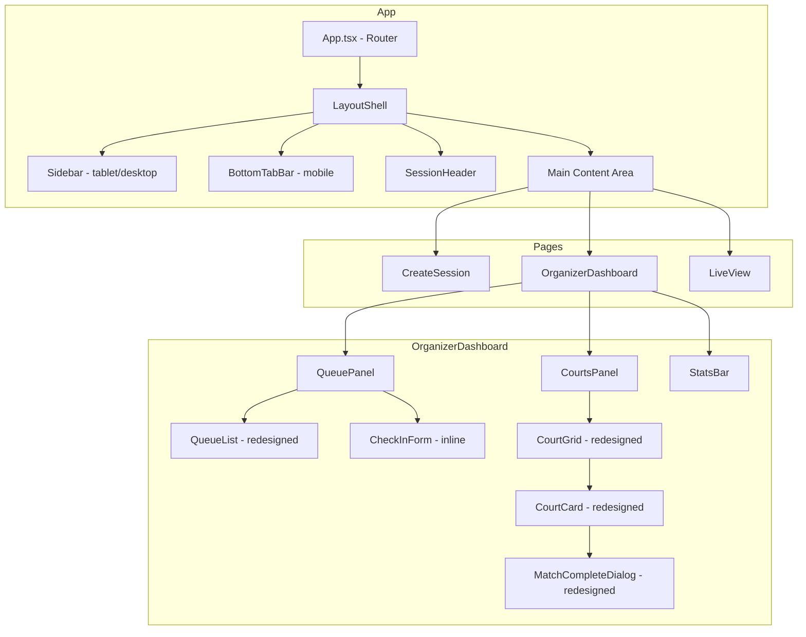
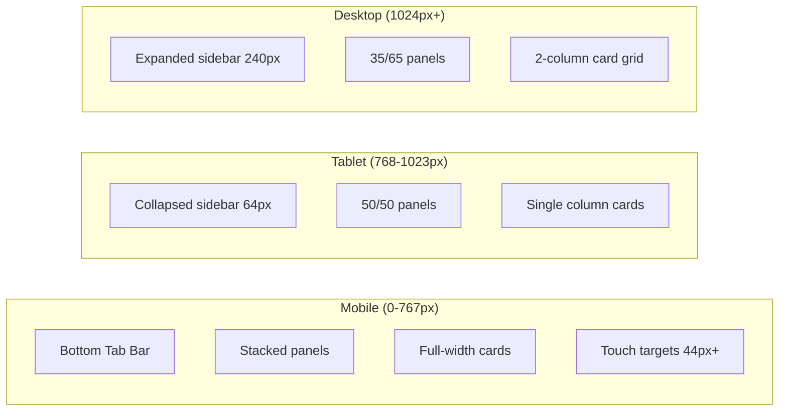

# Design Document: UI Responsive Redesign

## Overview

This design transforms the Picklestack client from a single-column, inline-styled layout into a responsive, component-based application with proper navigation, two-panel layouts, and mobile-first design. The redesign introduces a CSS custom properties system, a responsive Layout Shell with adaptive navigation, a two-panel OrganizerDashboard, redesigned queue and court card components, and mobile touch optimizations.

The current architecture uses inline `style` attributes throughout all components and renders everything inside a single `.page` container with `max-width: 800px`. The redesign replaces this with a structured CSS approach in `index.css` using custom properties for theming, utility classes for common patterns, and component-scoped class names for layout.

### Key Design Decisions

1. **CSS-only approach (no CSS-in-JS library)** — The project has zero CSS dependencies. We keep it that way by expanding `index.css` with custom properties and component classes. This avoids adding build complexity and keeps bundle size minimal.
2. **Single Layout Shell component** — A new `LayoutShell` component wraps all routed pages, providing sidebar/bottom-tab navigation and the session header. This replaces the bare `<Routes>` in `App.tsx`.
3. **Progressive enhancement via media queries** — Mobile-first base styles with `min-width` breakpoints for tablet (768px) and desktop (1024px). No JavaScript-based breakpoint detection.
4. **Component refactoring, not rewriting** — Existing component logic (state, API calls, event handlers) is preserved. Only the rendering markup and styling changes.

## Architecture



### Responsive Behavior Flow



## Components and Interfaces

### New Components

#### LayoutShell

The top-level layout wrapper rendered inside `App.tsx` around all routes.

```typescript
interface LayoutShellProps {
  children: React.ReactNode;
}

// Internal state
interface LayoutShellState {
  activeRoute: string; // derived from useLocation()
}
```

**Responsibilities:**
- Renders `Sidebar` on tablet/desktop, `BottomTabBar` on mobile (CSS-driven visibility)
- Renders `SessionHeader` when a session route is active
- Provides the main content area with proper margins/padding based on sidebar state

#### Sidebar

```typescript
interface SidebarProps {
  activeRoute: string;
}

interface NavItem {
  path: string;
  label: string;
  icon: string; // emoji or SVG reference
}
```

**Nav items:** Dashboard, Live View, Players, Settings
**Behavior:** Collapsed (icons only, 64px) on tablet, expanded (icons + labels, 240px) on desktop. Hidden on mobile.

#### BottomTabBar

```typescript
interface BottomTabBarProps {
  activeRoute: string;
}
```

**Behavior:** Fixed to viewport bottom on mobile. Hidden on tablet/desktop. Each tab is 44x44px minimum touch target.

#### SessionHeader

```typescript
interface SessionHeaderProps {
  sessionName: string;
  isLive: boolean;
  courtName?: string;
  dateTime: string;
  pairingMode: PairingMode;
  onTogglePairingMode: () => void;
  onOpenSettings: () => void;
  onEndSession: () => void;
}
```

**Behavior:** Fixed at top of content area. Stacks vertically on mobile with icon-only buttons. Shows pulsing green dot for live status.

#### StatsBar

```typescript
interface StatsBarProps {
  totalPlayers: number;
  matchesPlayed: number;
  averageWinRate: number;
  averageRating: number;
  pairingMode: string;
}
```

**Behavior:** Horizontal row on tablet/desktop, 2x3 grid on mobile. Positioned at bottom of dashboard content.

### Refactored Components

#### QueuePanel (wrapper around QueueList)

```typescript
interface QueuePanelProps {
  queue: EnrichedQueueEntry[];
  sessionId: string;
  gameMode: GameMode;
  matchingMode: MatchingMode;
  onMoveUp: (playerId: string) => Promise<void>;
  onMoveDown: (playerId: string) => Promise<void>;
  onRemove: (playerId: string) => Promise<void>;
  onPlayerClick: (playerId: string) => void;
  onCheckIn: (name: string, starRating: StarRating) => Promise<void>;
}
```

**Changes to QueueList rendering:**
- Each entry becomes a row with: circular avatar (36px, hash-colored), name, star icons, numeric rating, W-L record
- On Deck players get a 4px left border (`--color-warning`) and warm background tint
- Queue management buttons (↑ ↓ ✕) appear on hover (desktop) or always visible (mobile/tablet)
- Streak badge (🔥 for wins, ❄️ for losses) shown when streak ≥ 2
- Minimum 56px row height on mobile for touch targets
- Swipe-to-remove on mobile

#### CourtsPanel (wrapper around CourtGrid)

```typescript
interface CourtsPanelProps {
  sessionId: string;
  courts: Court[];
  activeMatches: ActiveMatch[];
  queueLength: number;
  playerStats: PlayerStats[];
  achievements: Achievement[];
  headToHeadRecords: Record<string, HeadToHeadRecord[]>;
  onStartMatch: (courtNumber: number) => Promise<void>;
  onCompleteMatch: (courtNumber: number) => Promise<void>;
  onMatchCompleted: () => void;
  onPlayerClick: (playerId: string) => void;
}
```

**Changes to CourtCard rendering:**
- Card header: court number + Status Badge (colored pill)
- Status Badge colors: green "In Progress", amber "Next Up", gray "Available"
- Left border accent matching status color
- Team sections with player avatars, names, star ratings, numeric ratings
- "VS" divider between teams
- Footer: match number + elapsed duration ("Xm")
- Full-width "Complete Match" button with `--color-success`
- 2-column grid on desktop, single column on tablet/mobile

#### MatchCompleteDialog (redesigned)

**Changes:**
- Side-by-side team layout on desktop/tablet, stacked on mobile
- Each team shown as a selectable card with avatars, names, ratings
- Radio selection for winning team (card highlights on selection)
- Score inputs below team cards
- Dialog header shows court number + match duration
- Mobile: full-width slide-up sheet from bottom
- Footer: "Skip Match" (secondary) + "Confirm Result" (primary)

### PlayerAvatar Utility Component

```typescript
interface PlayerAvatarProps {
  name: string;
  size?: number; // default 36
}
```

Renders a circular div with initials (first + last name initial) on a hash-derived background color. Used across QueueList, CourtCard, and MatchCompleteDialog.

## Data Models

No new data models are introduced. The redesign operates on existing types:

- `Session` — session metadata displayed in SessionHeader
- `QueueEntry` + `PlayerStats` — enriched queue entries for QueuePanel
- `Court` + `ActiveMatch` — court state for CourtsPanel/CourtCards
- `PlayerStats` — aggregated for StatsBar calculations

### Computed Values for StatsBar

```typescript
interface ComputedStats {
  totalPlayers: number;        // queue.length + active match players
  matchesPlayed: number;       // count of completed matches
  averageWinRate: number;      // mean of all playerStats[].winRate
  averageRating: number;       // mean of all playerStats[].rating
  pairingMode: string;         // session.matchingMode label
}
```

### Avatar Color Derivation

```typescript
function getAvatarColor(name: string): string {
  // Simple hash of name string to select from a predefined palette
  const colors = ['#2563eb', '#7c3aed', '#db2777', '#ea580c', '#16a34a', '#0891b2', '#4f46e5', '#c026d3'];
  let hash = 0;
  for (let i = 0; i < name.length; i++) {
    hash = name.charCodeAt(i) + ((hash << 5) - hash);
  }
  return colors[Math.abs(hash) % colors.length];
}
```

## Error Handling

The redesign does not change error handling logic. Existing error states (session not found, expired, restoration failure) continue to render within the Layout Shell's content area using the existing patterns.

**New visual considerations:**
- Error states render inside the main content area (to the right of sidebar on desktop)
- Loading states use the same layout structure
- Network errors during stats computation (for StatsBar) gracefully show "—" placeholders
- If session data is unavailable, SessionHeader shows the session name only with no action buttons

## Testing Strategy

### Why Property-Based Testing Does Not Apply

This feature is a UI rendering and layout redesign. The acceptance criteria describe:
- Visual states at different viewport widths (responsive breakpoints)
- CSS styling (colors, spacing, typography)
- Component layout and positioning
- Touch interaction behavior
- Animation and visual feedback

These are not pure functions with input/output behavior that varies meaningfully across a large input space. There are no serialization round-trips, data transformations, or algorithmic logic to validate with PBT. The correct testing approach is example-based component tests and visual verification.

### Testing Approach

**Unit Tests (example-based):**
- `getAvatarColor()` — verify deterministic color output for known names
- `getOnDeckPlayerIds()` — already tested, verify no regression
- `ComputedStats` calculation — verify averages with known data sets
- Component rendering — verify correct CSS classes are applied based on props

**Component Tests (React Testing Library):**
- `LayoutShell` renders Sidebar on desktop viewport, BottomTabBar on mobile
- `SessionHeader` displays session name, live badge, action buttons
- `QueuePanel` renders player entries with avatars, ratings, On Deck highlighting
- `CourtCard` renders correct Status Badge based on court status
- `MatchCompleteDialog` renders team cards, score inputs, action buttons
- `StatsBar` displays all metrics with correct formatting

**Visual/Integration Tests:**
- Responsive layout verification at 375px (mobile), 768px (tablet), 1280px (desktop)
- Navigation state (active tab/sidebar item) matches current route
- Touch target sizing verification (minimum 44x44px)
- Color contrast verification for WCAG AA compliance

**Snapshot Tests:**
- Component output at each breakpoint to catch unintended layout regressions

### Test Configuration

- Framework: Vitest (already configured in the project)
- Component testing: React Testing Library (to be added as dev dependency)
- Viewport simulation: `window.matchMedia` mocking for responsive tests
- No E2E framework required for this phase; visual verification is manual

### CSS Architecture Validation

Since CSS custom properties and class-based styling replace inline styles, tests should verify:
- Components render with expected class names (not inline styles)
- CSS custom properties are defined in `:root` (can be verified by reading the CSS file)
- No remaining inline `style` attributes in redesigned components (lint rule or test assertion)
