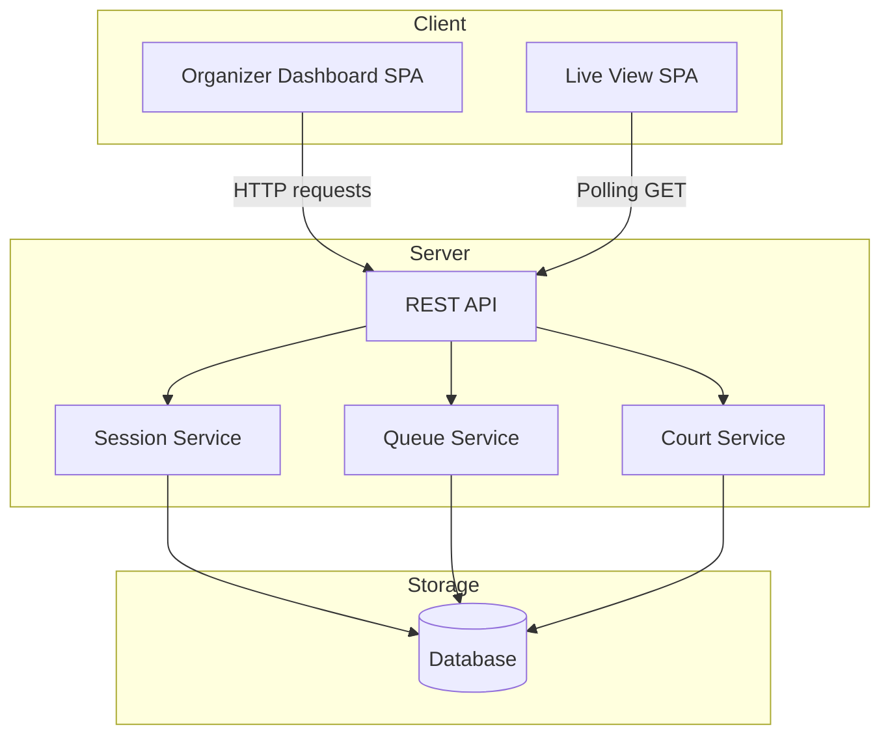
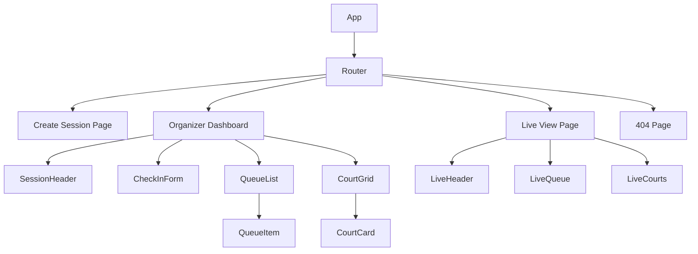

# Design Document: Pickleball Queue System

## Overview

Picklestack is a web application for managing pickleball open play sessions. The core system provides a queue-based rotation mechanism where an organizer creates a session, checks players in, assigns groups of 4 to available courts, and rotates them back into the queue when matches complete. Players get a live read-only view of the queue and court status via a shareable URL.

This design covers Phase 1: session creation, player check-in, queue ordering, court assignment/rotation, live player view, state persistence, and session end.

### Key Design Decisions

- **Single-page application (SPA)** with a backend API for state management and persistence
- **Real-time updates** via polling (sub-5-second refresh) for the live player view
- **Server-side state** persisted to a database for durability across browser closures
- **No authentication for players** — the live view is accessible via a unique URL without login
- **Organizer access** via a unique session URL (no account system in Phase 1)

## Architecture



### Technology Stack

- **Frontend**: React with TypeScript (Vite build tooling)
- **Backend**: Node.js with Express and TypeScript
- **Database**: SQLite (file-based, simple deployment for Phase 1)
- **Real-time**: Client-side polling every 3 seconds on the live view

### Request Flow

1. Organizer actions (create session, check-in, move player, start/end match) → POST/PUT/DELETE to REST API
2. API validates input → delegates to service layer → persists state → returns updated state
3. Live view polls GET endpoint every 3 seconds → receives current session snapshot

## Components and Interfaces

### API Endpoints

| Method | Path | Description |
|--------|------|-------------|
| POST | `/api/sessions` | Create a new session |
| GET | `/api/sessions/:sessionId` | Get session state (organizer) |
| GET | `/api/sessions/:sessionId/live` | Get session state (live view) |
| POST | `/api/sessions/:sessionId/players` | Check in a player |
| DELETE | `/api/sessions/:sessionId/players/:playerId` | Remove a player |
| PUT | `/api/sessions/:sessionId/queue/move` | Move a player in the queue |
| POST | `/api/sessions/:sessionId/courts/:courtNumber/start` | Start a match |
| POST | `/api/sessions/:sessionId/courts/:courtNumber/complete` | Complete a match |
| POST | `/api/sessions/:sessionId/end` | End the session |

### Service Layer

#### SessionService

- `createSession(name: string, courtCount: number): Session` — validates inputs, creates session with unique ID and live view URL. Session is persisted even if subsequent dashboard display fails.
- `getSession(sessionId: string): Session | null` — retrieves full session state
- `endSession(sessionId: string): SessionSummary` — marks session complete, clears queue, returns summary

#### QueueService

- `addPlayer(sessionId: string, playerName: string): Player` — validates name, checks duplicates, appends to queue
- `removePlayer(sessionId: string, playerId: string): void` — removes from queue or active match
- `movePlayer(sessionId: string, playerId: string, direction: 'up' | 'down'): Queue` — reorders queue
- `getQueue(sessionId: string): QueueEntry[]` — returns ordered queue

#### CourtService

- `startMatch(sessionId: string, courtNumber: number): Match` — assigns top 4 from queue to court
- `completeMatch(sessionId: string, courtNumber: number): void` — returns players to queue end, frees court. If no active match exists on the court, returns error and preserves all current state (match and court status unchanged).
- `getCourts(sessionId: string): Court[]` — returns all courts with status

### Frontend Components



- **CreateSession**: Form with session name and court count inputs, validation display
- **OrgDashboard**: Main organizer interface with check-in, queue management, court controls
- **CheckInForm**: Player name input with duplicate/validation error display
- **QueueList**: Ordered list with move up/down and remove buttons per player
- **CourtGrid**: Grid of court cards showing status (available/active) and assigned players
- **LiveView**: Read-only view with queue, courts, and "up next" highlighting

## Data Models

### Session

```typescript
interface Session {
  id: string;              // UUID
  name: string;            // 1-50 chars after trim
  courtCount: number;      // 1-12 inclusive
  status: 'active' | 'ended';
  liveViewUrl: string;     // Unique shareable URL
  createdAt: Date;
  updatedAt: Date;
}
```

### Player

```typescript
interface Player {
  id: string;              // UUID
  sessionId: string;       // FK to Session
  name: string;            // 1-30 chars, at least 1 non-whitespace
  checkedInAt: Date;
}
```

### QueueEntry

```typescript
interface QueueEntry {
  playerId: string;        // FK to Player
  sessionId: string;       // FK to Session
  position: number;        // 0-based index
}
```

### Court

```typescript
interface Court {
  sessionId: string;       // FK to Session
  courtNumber: number;     // 1-based, up to courtCount
  status: 'available' | 'active';
}
```

### Match

```typescript
interface Match {
  id: string;              // UUID
  sessionId: string;       // FK to Session
  courtNumber: number;     // Which court
  playerIds: string[];     // Exactly 4 player IDs, ordered by original queue position
  status: 'active' | 'completed';
  startedAt: Date;
  completedAt?: Date;
}
```

### SessionSummary

```typescript
interface SessionSummary {
  totalPlayersCheckedIn: number;
  totalMatchesCompleted: number;
}
```

### Database Schema

```sql
CREATE TABLE sessions (
  id TEXT PRIMARY KEY,
  name TEXT NOT NULL,
  court_count INTEGER NOT NULL,
  status TEXT NOT NULL DEFAULT 'active',
  live_view_url TEXT NOT NULL UNIQUE,
  created_at TEXT NOT NULL,
  updated_at TEXT NOT NULL
);

CREATE TABLE players (
  id TEXT PRIMARY KEY,
  session_id TEXT NOT NULL REFERENCES sessions(id),
  name TEXT NOT NULL,
  checked_in_at TEXT NOT NULL
);

CREATE TABLE queue_entries (
  player_id TEXT PRIMARY KEY REFERENCES players(id),
  session_id TEXT NOT NULL REFERENCES sessions(id),
  position INTEGER NOT NULL
);

CREATE TABLE matches (
  id TEXT PRIMARY KEY,
  session_id TEXT NOT NULL REFERENCES sessions(id),
  court_number INTEGER NOT NULL,
  player_ids TEXT NOT NULL,  -- JSON array of player IDs
  status TEXT NOT NULL DEFAULT 'active',
  started_at TEXT NOT NULL,
  completed_at TEXT
);

CREATE UNIQUE INDEX idx_active_court ON matches(session_id, court_number) WHERE status = 'active';
```

## Correctness Properties

*A property is a characteristic or behavior that should hold true across all valid executions of a system — essentially, a formal statement about what the system should do. Properties serve as the bridge between human-readable specifications and machine-verifiable correctness guarantees.*

### Property 1: Session creation validation partitions inputs correctly

*For any* string `name` and number `courtCount`, the session creation validation function accepts the input if and only if `name.trim()` has length between 1 and 50 inclusive AND `courtCount` is a whole number between 1 and 12 inclusive. Invalid inputs produce an error identifying the invalid field(s).

**Validates: Requirements 1.1, 1.2, 1.4**

### Property 2: Session creation produces unique URLs

*For any* two distinct valid session creation requests, the generated live view URLs shall be different.

**Validates: Requirements 1.3**

### Property 3: Player name validation partitions inputs correctly

*For any* string `playerName`, the player name validation function accepts the input if and only if `playerName` contains at least 1 non-whitespace character AND `playerName.length` is at most 30 characters.

**Validates: Requirements 2.2, 2.5**

### Property 4: Player check-in appends to queue end

*For any* session with an existing queue of N players, when a valid new player is checked in, that player's queue position shall be N (zero-based), and all previously queued players retain their original positions.

**Validates: Requirements 2.1**

### Property 5: Duplicate player name detection is case-insensitive

*For any* checked-in player with name `existingName`, attempting to check in a player whose name equals `existingName` under case-insensitive comparison shall be rejected, and the queue shall remain unchanged.

**Validates: Requirements 2.3**

### Property 6: Queue positions are sequential from zero after any operation

*For any* queue state resulting from any sequence of valid operations (check-in, move, remove, match start, match complete), the queue positions shall be consecutive integers starting from 0 with no gaps or duplicates.

**Validates: Requirements 3.1, 3.4, 6.4**

### Property 7: Queue move preserves all players without duplication

*For any* queue of N players and any valid move operation (player, direction), the resulting queue shall contain exactly the same N players (no additions, no removals, no duplicates), with only the moved player's position changed by at most 1.

**Validates: Requirements 3.2, 3.3**

### Property 8: Match start assigns top 4 from queue and updates state

*For any* session with a queue of N ≥ 4 players and an available court, starting a match on that court shall: assign the first 4 players from the queue to that court in their queue order, set the court status to active, and leave a queue of N - 4 players with positions re-numbered from 0 preserving relative order.

**Validates: Requirements 4.2, 4.3**

### Property 9: Match startable only when queue has 4+ players and court is available

*For any* session state, a court is indicated as match-startable if and only if the court status is available AND the queue contains at least 4 players.

**Validates: Requirements 4.1, 4.4**

### Property 10: Match completion returns players to queue end in assignment order

*For any* session with an active match and an existing queue of N players, completing that match shall append the match's players to the queue at positions N, N+1, N+2, N+3 in the order they were originally assigned to the court, and set the court status to available.

**Validates: Requirements 3.6, 5.1, 5.2**

### Property 11: Removed players are excluded from match completion rotation

*For any* active match where K players (0 ≤ K ≤ 4) have been removed from the session during the match, completing that match shall only return the remaining (4 - K) players to the queue.

**Validates: Requirements 5.5**

### Property 12: Live view response contains complete session state

*For any* active session state, the live view response shall include: every queued player with their correct position and name, every active court with its assigned player names, and the first 4 players in the queue marked as "up next".

**Validates: Requirements 6.1**

### Property 13: Session state persistence round trip

*For any* valid session state (queue order, active matches, player roster), persisting and then restoring the state within 24 hours of the last state change shall produce an equivalent session state. If more than 24 hours have elapsed since the last state change, restoration shall not occur regardless of whether the browser remained open.

**Validates: Requirements 7.2**

### Property 14: Session end clears queue and rejects new check-ins

*For any* active session, ending the session shall mark it as complete, result in an empty queue, and cause all subsequent check-in attempts to be rejected.

**Validates: Requirements 8.1**

### Property 15: Session summary counts are accurate

*For any* session where P players were checked in and M matches were completed (including active matches force-completed on session end), the session summary shall report exactly P total players and exactly M total matches.

**Validates: Requirements 8.3, 8.5**

## Error Handling

### Input Validation Errors

| Scenario | Response | HTTP Status |
|----------|----------|-------------|
| Invalid session name (empty/too long after trim) | `{ error: "Session name must be 1-50 characters" }` | 400 |
| Invalid court count (not 1-12 integer) | `{ error: "Court count must be between 1 and 12" }` | 400 |
| Invalid player name (whitespace-only or >30 chars) | `{ error: "Player name must be 1-30 characters with at least one non-whitespace character" }` | 400 |
| Duplicate player name | `{ error: "A player with this name already exists in the session" }` | 409 |

### State Conflict Errors

| Scenario | Response | HTTP Status |
|----------|----------|-------------|
| Start match on occupied court | `{ error: "Court is already occupied with an active match" }` | 409 |
| Start match with < 4 players in queue | (silently disabled in UI, no error message displayed) | 422 |
| Complete match on court with no active match | `{ error: "No active match on this court" }` (all state preserved unchanged) | 404 |
| Check-in to ended session | `{ error: "Session has ended, no new check-ins accepted" }` | 403 |
| Session not found | `{ error: "Session not found" }` | 404 |

### Data Integrity Errors

| Scenario | Response | HTTP Status |
|----------|----------|-------------|
| Corrupted session state on restore | `{ error: "Session state could not be restored", offerNewSession: true }` (only for corruption, unreadable, or restoration failure conditions) | 500 |
| Database write failure | `{ error: "Failed to save session state" }` | 500 |

### Frontend Error Handling

- Validation errors displayed inline next to the relevant form field
- Conflict errors displayed as toast notifications
- Network errors displayed as a banner with retry option
- Form state preserved on all error conditions (user input not cleared)

## Testing Strategy

### Unit Tests

Unit tests cover specific examples, edge cases, and error conditions:

- **Session creation**: Valid form submission, boundary values (1 char name, 50 char name, 1 court, 12 courts)
- **Player check-in**: Valid name, whitespace-only rejection, exact 30 char name, duplicate detection
- **Queue operations**: Move at boundaries (first up, last down), remove from single-player queue
- **Court assignment**: Start match with exactly 4 players, attempt on occupied court
- **Match completion**: Complete with removed player, complete non-active match
- **Session end**: End with active matches, end with empty queue
- **Live view**: Non-existent session 404, ended session display

### Property-Based Tests

Property-based tests verify universal properties across randomized inputs using **fast-check** (TypeScript property-based testing library).

Each property test runs a minimum of **100 iterations** with randomized inputs.

| Property | Test Description | Tag |
|----------|-----------------|-----|
| 1 | Generate random strings/numbers, verify session validation | Feature: pickleball-queue-system, Property 1: Session creation validation partitions inputs correctly |
| 2 | Create multiple sessions, verify URL uniqueness | Feature: pickleball-queue-system, Property 2: Session creation produces unique URLs |
| 3 | Generate random strings, verify player name validation | Feature: pickleball-queue-system, Property 3: Player name validation partitions inputs correctly |
| 4 | Generate queues of varying size, check in player, verify end position | Feature: pickleball-queue-system, Property 4: Player check-in appends to queue end |
| 5 | Generate names with case variations, verify duplicate rejection | Feature: pickleball-queue-system, Property 5: Duplicate player name detection is case-insensitive |
| 6 | Generate random operation sequences, verify positions sequential from 0 | Feature: pickleball-queue-system, Property 6: Queue positions are sequential from zero after any operation |
| 7 | Generate random queues and moves, verify player set preserved | Feature: pickleball-queue-system, Property 7: Queue move preserves all players without duplication |
| 8 | Generate queues with 4+ players, start match, verify assignment and queue state | Feature: pickleball-queue-system, Property 8: Match start assigns top 4 from queue and updates state |
| 9 | Generate random queue sizes and court states, verify startable indicator | Feature: pickleball-queue-system, Property 9: Match startable only when queue has 4+ players and court is available |
| 10 | Generate sessions with matches, complete, verify return order | Feature: pickleball-queue-system, Property 10: Match completion returns players to queue end in assignment order |
| 11 | Generate matches with removed players, complete, verify exclusion | Feature: pickleball-queue-system, Property 11: Removed players are excluded from match completion rotation |
| 12 | Generate random session states, verify live view response completeness | Feature: pickleball-queue-system, Property 12: Live view response contains complete session state |
| 13 | Generate random session states, persist/restore, verify equality | Feature: pickleball-queue-system, Property 13: Session state persistence round trip |
| 14 | Generate active sessions, end them, verify state cleared and check-ins rejected | Feature: pickleball-queue-system, Property 14: Session end clears queue and rejects new check-ins |
| 15 | Generate sessions with various match counts, end, verify summary accuracy | Feature: pickleball-queue-system, Property 15: Session summary counts are accurate |

### Integration Tests

- Live view polling delivers updates within 5 seconds (Requirement 6.2)
- State persists within 2 seconds of change (Requirement 7.1)
- Live view accessible without authentication (Requirement 6.3)
- Live view served while organizer browser is closed (Requirement 7.4)

### End-to-End Tests

- Full session lifecycle: create → check-in players → start matches → complete matches → end session
- Multiple concurrent courts with rotation
- Live view reflects real-time state changes

